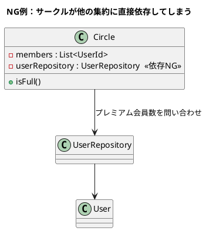
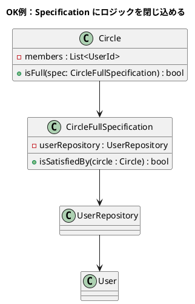
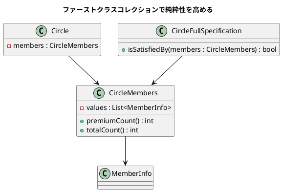
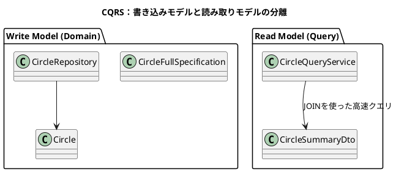

了解です！  
あなたが投稿した長い対話文は、**DDDの「仕様（Specification）パターン」**をテーマにした、とても良い材料です。  
これを **NotebookLM に最適化した「解説ノート＋PlantUML 図解つきのまとめ」** として作り直します。

以下は、  
**あなたの語り口（対話形式）を保ちつつ整理した“読書ノート”＋PlantUML図解**です。  
今すぐ NotebookLM に読み込めます。

---

# 📘 NotebookLM 読書ノート

## Deep Dive：DDD「仕様（Specification）パターン」編

（元テキスト：あなたの対話文を構造化して整理したもの）

---

# 🧩 **一言まとめ（TL;DR）**

> **仕様（Specification）パターンとは、  
> 複雑なビジネスルールを「判断専用クラス」に切り出して、  
> ドメインモデルの純粋性を守りつつ、変更に強い設計を実現するための武器である。**

---

# 🎯 章の中心テーマ

- DDD の「純粋なドメインモデル」を守るためには、  
    ビジネスルール（満員判定 / プレミアム条件）は **ドメイン外に漏れてはならない**。
    
- しかし現実のシステムでは、複雑な条件判定は **別の集約**（例：User）や  
    **外部リポジトリ**に情報を問い合わせないと判断できない。
    
- その “知識の分散” を防ぎ、ルールを 1 箇所に閉じ込めるための道具が **Specification**。
    

---

# 🏛️ なぜ必要なのか？（問題設定）

資料で示されていた例：

### **サークルのメンバー上限ルール**

- 通常は 30 人まで
    
- ただしプレミアム会員が 10 人以上いれば上限は 50 人
    

この追加ルールにより、問題が一気に増える：

|アプローチ|問題点|
|---|---|
|サークルにロジックを書く|サークルがプレミアム会員情報という「別の集約の内部情報」を知ってしまう → **集約の純粋性が壊れる**|
|アプリケーションサービスに書く|ドメインルールがアプリケーション層に “漏れ出す” → **ルールが散らばり破綻する**|

---

# 🧠 解決策：**Specification パターン**

> 条件判定を“独立オブジェクト”に閉じ込める  
> → ドメインモデルは純粋に保たれる  
> → ルール変更は Specification を直すだけで済む

---

## 📘 **PlantUML 図解① — 悪い構造（アンチパターン）**

「サークルが UserRepo に直接アクセスしてしまう例」



---

## 📘 **PlantUML 図解② — 正しい構造：Specification パターン**

「サークルは純粋なまま、判定を外部の Specification に委譲する」



---

## 📘 **PlantUML 図解③ — ファーストクラスコレクション化**

Specification がリポジトリ依存から解放される構造：



---

# 📊 仕様パターンのメリット

|メリット|説明|
|---|---|
|変更に強い|ルールを 1 箇所に閉じ込めるため、変更影響が局所化する|
|ドメインが純粋|サークルは “状態” だけを持ち、外部依存から解放される|
|判定ロジックが明確|`spec.isSatisfiedBy(circle)` という読みやすい構文|
|再利用できる|「満員判定」や「おすすめ判定」など複数箇所で使える|
|テスト容易|Specification を単体テストできる|

---

# 🔥 さらに深い話：仕様を検索に使う

「おすすめサークルを探す」などの  
**読み取り系ロジック（クエリ）**にも Specification を流用できる。

理想：

```ts
circleRepository.findBySpecification(recommendSpec)
```

現実：

- 全件読み込みしてメモリでフィルタ → 遅すぎて死亡
    
- 多数件がある世界では成立しない
    

ここで出てくるのが **CQRS**：

---

## 📘 **PlantUML 図解④ — CQRS の世界**



---

# 🧭 まとめ（この章で学んだこと）

- ドメインモデルは「純粋」であるべき
    
- 複雑なルールは Specification へ委譲
    
- Specification は “判定だけを行う小さな知性体”
    
- 検索条件にも使えるが、現実には CQRS で分離したほうが健全
    
- 設計の理想とパフォーマンスの現実は常にトレードオフ
    
- 仕様パターンと CQRS はそのバランスを取るための武器
    

---

# ❓ NotebookLM 向けの問い

> **あなたが普段使うアプリで、  
> “ルールをドメイン内に閉じ込めるべき場所”と  
> “パフォーマンスのためにクエリとして切り離すべき場所”  
> はどこにありますか？**

---

必要であれば：

✅ NotebookLM 用 “リサーチ引き金（質問リスト）”  
✅ Markdown のみ版  
✅ 図解だけの抽出版  
✅ 仕様パターンのコード例（TypeScript / PHP / C#）  
なども作成できます。

次どうしますか？