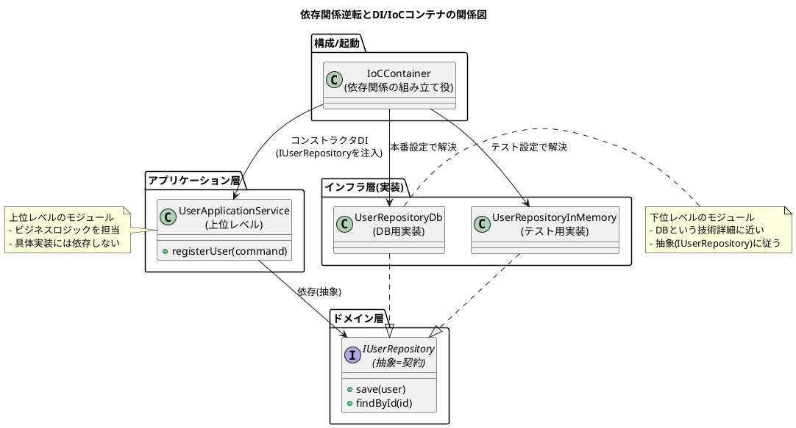

いいテーマきましたね。これはまさに「DDDの仕上げ」みたいな章でした。  
いつもの読書ノート＋PlantUMLでまとめます。

---

## ① この音声の一言まとめ

ソフトウェアの柔軟性は「依存を無くすこと」ではなく「依存の向きをコントロールすること」で生まれ、その核心が **依存関係逆転の原則（DIP）＋DI＋IoCコンテナ** である、という話。

---

## ② キーアイデア（3〜5個）

### 1. 依存は悪ではない。「向き」を支配できるかが勝負

- オブジェクト同士が依存し合うのは自然で、ゼロにはできない。
    
- 問題は「ビジネスロジックが技術詳細（DBなど）に従属している」状態。
    
- 目標：**ビジネスロジック側が主導権を持ち、技術をあとから差し替えられる構造** にする。
    

---

### 2. 「具体クラス → 抽象（IF）」へ矢印をひっくり返す＝DIP

- 悪い状態：  
    `UserApplicationService → UserRepositoryDb`（DB実装にベッタリ）
    
- 良い状態：  
    `UserApplicationService → IUserRepository ← UserRepositoryDb / UserRepositoryInMemory`
    
- DIPの2ルール：
    
    1. 上位レベル（ビジネス側）は下位レベル（技術側）に依存せず、**両者とも抽象に依存** すべき。
        
    2. 抽象は詳細に依存せず、**詳細が抽象に依存** すべき。
        

---

### 3. テストと技術変更の“痛み”がほぼDIPで説明できる

- 具体クラスに依存すると：
    
    - ちょっとロジックを試すだけなのに**本物DBの準備が必須**。
        
    - DB変更（RDB→NoSQLなど）のたびに**ビジネスコード側まで改修**が波及。
        
- 抽象に依存すると：
    
    - テスト時は `InMemoryUserRepository` に差し替えるだけでOK。
        
    - 本番では `UserRepositoryDb` に切替えるだけ。ビジネス側はノータッチ。
        

---

### 4. サービスロケーターは「便利そうに見えて地獄」なアンチパターン

- 長所：設定を中央集約でき、モード切り替えが簡単そうに見える。
    
- でも欠点が致命的：
    
    - **依存関係がコードから見えない**（シグネチャに出てこない）。
        
    - 登録漏れが**コンパイル時に検知できず、実行時に爆発**。
        
    - テストが壊れても実行するまで気づかず、だんだん誰もテストしなくなる。
        

---

### 5. DI＋IoCコンテナは「依存の可視化＋自動組み立て」の両取り

- DI（依存性注入）：
    
    - クラスの必要物を**コンストラクタ引数などで外から注入**する。
        
    - シグネチャを見れば「このクラスが何に依存しているか」が一目でわかる。
        
- IoCコンテナ：
    
    - 「`IUserRepository` にはこれを使う」というルールを登録しておく箱。
        
    - `resolve(UserApplicationService)` と頼むだけで、コンテナが依存ツリーを辿って全部組み立ててくれる。
        
- 何より強いのが：
    
    - 依存を追加・変更すると**テストコードがコンパイルエラーで一斉に知らせてくれる**＝テストが健全な状態を保ちやすい。
        

---

## ③ いい比喩・表現メモ

- **ジェンガ比喩**  
    中央のブロックを抜いた瞬間に全体が崩れそうな恐怖＝依存が絡み合ったコードの変更。
    
- **「エンジンをシャーシに溶接」した車**  
    DB実装にベッタリ依存したビジネスロジックは、エンジン交換できない車みたいなもの。
    
- **契約書としてのインターフェース**  
    IFは「こういう機能を提供します」という契約書であり、相手が誰かは問わない。
    
- **コンパイルエラーは未来の自分を救う安全装置**  
    DI＋コンストラクタ注入にすると、依存追加の影響をコンパイルエラーで即座に教えてくれる。
    

---

## ④ 印象的なQ&A

**Q1. 具体クラスに依存するとなぜソフトウェアが“固くなる”の？**  
A. テストごとに本物DBが必要になり、技術変更のたびにビジネス側コードを直さないといけないから。ジェンガ状態になる。

---

**Q2. DIPの「上位レベル・下位レベル」はどう区別する？**  
A. 機械からの距離で考える。ビジネスルールに近いもの（ユーザーアプリケーションサービス）が上位、DB操作のような具体技術に近いものが下位。

---

**Q3. サービスロケーターの何がそんなに悪いの？**  
A. 依存がシグネチャに出てこないので、クラスを見ても何に依存しているか分からない。登録漏れや仕様変更の影響がコンパイル時に検知できず、実行時に爆発する。

---

**Q4. DI＋IoCコンテナの一番のメリットは？**  
A. 依存関係が**常に可視化され、コンパイル時に検証できる**こと。これがテストの健全性と長期的な柔軟性を支えてくれる。

---

## ⑤ 自分のプロジェクトにどう活かすか（ToDo）

1. **既存コードで「具体クラスに直接 `new` している」アプリケーションサービスを洗い出す**
    
    - 特に DB, クライアント, 外部APIクラスへのベタ依存をチェック。
        
2. **優先度の高い箇所から `I◯◯Repository` / `I◯◯Client` のようなインターフェースを切り出す**
    
    - まずは1つでいいので、DIPをちゃんと通した“縦の一筋”を作る。
        
3. **小さな範囲でコンストラクタDI＋（あれば）IoCコンテナを導入してみる**
    
    - そのクラスのテストが「どれだけ書きやすくなるか」を体感する。
        

---

## ⑥ PlantUML図（DIP＋DI＋IoCコンテナの構造）

---

もし「サービスロケーター版の悪い例の図も欲しい」「自分のプロジェクト構成に合わせてクラス名変えてほしい」みたいなのがあれば、そのままテキスト貼ってくれれば合わせて描き直します。