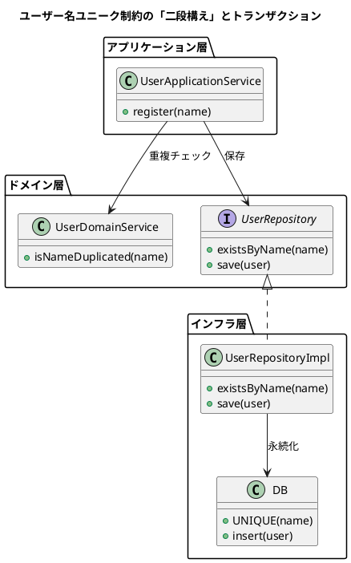

いい流れで読み進めてますね、この章もかなり “実戦寄り” でした。  
前回までと同じフォーマットで読書ノートまとめておきます。

---

# 📘 ドメイン駆動設計：データ整合性とトランザクション章 読書ノート

---

## ① 一言まとめ

**アプリケーションのビジネスルール（例: ユーザー名は一意）と、DB の制約・トランザクションという技術的仕組みを「二段構え」で組み合わせて、競合や整合性崩壊からシステムを守る話。**

---

## ② キーアイデア（3〜5個）

### 1. 「時間」がバグを生む ― 競合状態（レースコンディション）

- コードだけ見ると正しく見える `exist → save` の流れも、  
    **同時に2人が同じ名前で登録**した瞬間に破綻する。
    
- A と B が “ほぼ同時” に `Exist("NARSE")` を見ると、どちらも「いない」と判断してしまい、  
    結果的に **同じユーザー名が2件登録される**。
    

> 問題はコードの中ではなく「時間のズレ」の中に潜んでいる。

---

### 2. DB のユニーク制約は「最後の砦」であって、ルールの本体ではない

- DB の UNIQUE 制約を張れば、「同じユーザー名2件」は確かに防げる。
    
- でも **アプリコードから「ユーザー名はユニーク」というビジネスルールが消える**。
    
    - コードからはルールが見えない（表現力の喪失）。
        
    - ルールが **特定DB（RDB の UNIQUE 機能）にベッタリ依存**する。
        
- 将来 NoSQL や別の永続化手段に変えたとき、  
    「あ、ここにもユニーク制約必要だったんだ…」に気づけない危険。
    

> ✅ ベストは「アプリでルールを明示」＋「DB 制約でセーフティネット」の二段構え。

---

### 3. トランザクションで「処理のかたまり」に一貫性を与える

- ユーザー登録のように、
    
    - 重複チェック
        
    - 保存  
        をバラバラに実行すると、その間に別の処理が割り込める。
        
- トランザクションで **「全部成功 or 全部失敗」** にすることで、
    
    - 途中だけ終わった中途半端な状態を防ぐ。
        
    - 重複チェックと保存を **他の処理から隔離**できる。
        

---

### 4. でも素直にトランザクションを書くと「技術依存まみれ」になる罠

- アプリケーションサービスの中で `SqlConnection`, `SqlTransaction` などを直接触り始めると、
    
    - ビジネスロジックが **特定DBベンダーの API に汚染**される。
        
    - メモリ上でのテストや、DB 差し替えがしんどくなる。
        
- これを避けるために出てくるのが、**宣言的なトランザクションパターン**たち。
    

---

### 5. トランザクションを「宣言」で扱う3つのパターン

1. **TransactionScope（C#）**
    
    - `using (var scope = new TransactionScope()) { ... }` のように範囲を宣言。
        
    - ビジネスロジック側は「ここからここまで整合性ほしい」と宣言するだけ。
        
    - 具体的な DB 操作はインフラ層におまかせ。
        
2. **AOP（アスペクト指向 / Java の `@Transactional` など）**
    
    - メソッドにアノテーションを一つつけるだけ。
        
    - 本体コードは一切トランザクション処理を書かない。
        
    - 「このメソッドはトランザクションが必要」という意図が一目で分かる。
        
3. **Unit of Work（ユニット・オブ・ワーク）**
    
    - 変更を「その場で DB に反映」せず、まず **ユニットオブワーク（カート）に貯める**。
        
    - 最後に `commit()` でまとめて DB に反映。
        
    - Entity Framework などが典型例。
        

> どれも共通しているのは、**「ビジネスロジックから特定の DB 技術を切り離す」**こと。

---

### 6. ロックと集約 ― 整合性とパフォーマンスのトレードオフ

- トランザクションは内部で **ロック** を使って整合性を守る。
    
- ロック範囲・時間が長すぎると、他のユーザーの処理が詰まり、システムが重くなる。
    
- そこで DDD 的に出てくるのが **集約（Aggregate）** の考え方。
    
    - **「1トランザクションで整合性を保証するのは1集約だけ」**
        
    - 集約を小さく保つことで、ロックの範囲も小さくできる。
        

---

## ③ いい比喩・印象に残る表現

- **通販のヘッダー＋ボディ**
    
    - ヘッダーだけ保存されてボディが消えた注文は「成立していない」＝整合性崩壊。
        
- **本当の敵はコードの中じゃなく『時間』の中にいる**
    
    - 同時実行によるバグをすごく直感的に表す一言。
        
- **ユニーク制約はセーフティーネット**
    
    - ルール本体ではなく「最後の防波堤」だと位置づける視点。
        
- **AOPは“処理の着せ替え”**
    
    - コアロジックに手を触れず、外側から機能（トランザクション）を着せるイメージ。
        
- **Unit of Work = ショッピングカート**
    
    - その場で会計せず、最後にまとめてレジに持っていく。
        

---

## ④ 印象的なQ&A（2〜5組）

---

### Q1. DBにユニーク制約があるなら、アプリ側の重複チェックって要らないのでは？

**A:**

- DB制約だけに頼ると、
    
    - コードからビジネスルールの痕跡が消える（読んだだけではルールが分からない）。
        
    - ルールが特定 DB の機能に“隠蔽”され、DB変更時に気づけない。
        
- だから
    
    - **アプリ側で「ルールを表現」**
        
    - **DB側で「物理的な破綻防止」**  
        の「二段構え」がよい。
        

---

### Q2. トランザクションを使えば競合は解決するけど、どこに書けばいい？

**A:**

- 生の `SqlTransaction` をアプリケーションサービスに書くと、技術依存まみれになる。
    
- そこで
    
    - C#なら `TransactionScope`
        
    - Javaなら `@Transactional` + AOP  
        のように **“宣言的” にトランザクションを指定**し、  
        実装はインフラ層に閉じ込めるのが良い。
        

---

### Q3. Unit of Work パターンはいつ使うべき？

**A:**

- 多数のエンティティに対する変更をまとめて扱いたいときに有効。
    
- ただし、仕組みが複雑になりがちなので、
    
    - まずは TransactionScope や AOP のようなシンプルな方法を優先し、
        
    - それで足りない・ORM を使う場合などに検討する、くらいの位置づけが現実的。
        

---

### Q4. ロックを強くかければかけるほど安全になるのでは？

**A:**

- 安全にはなるが、同時にシステムが“詰まる”リスクも増える。
    
- DDD 的には「**1トランザクションで1集約だけ**」という制約を守ることで、
    
    - 整合性とパフォーマンスのバランスを取る。
        

---

## ⑤ 自分が実際にやってみること（最大3つ）

- **① 現在のコードベースで「Exist → Save」のような二段構えになっている箇所を洗い出して、競合条件がないか疑ってみる。**
    
- **② アプリ側で表現されていない「隠れた DB 制約」（ユニークキーなど）がないか、スキーマを見ながら棚卸しする。**
    
- **③ 小さな機能でいいので、「TransactionScope あるいは AOP でトランザクションを宣言する」ミニ実装を作ってみる。**
    

---

# 🧱 PlantUML 図解：

「アプリのルール＋DB制約＋トランザクション」の二段構え

---

もしこの続きとして、

- **分散トランザクション（マイクロサービスをまたぐ整合性）**
    
- **メッセージング＋最終的整合性（イベント駆動）**
    
- **集約設計とロック戦略を、あなたの作りたいドメインで具体化**
    

みたいなところまで行きたくなったら、そのまま次の “ディープダイブ編” にも進めます。  
気になっているところから続き、いきましょう。