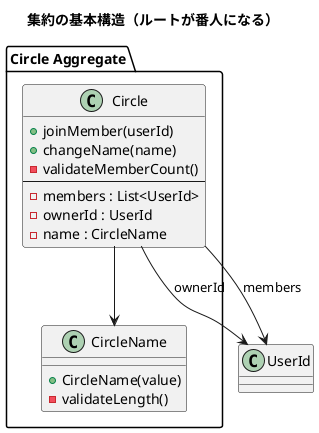
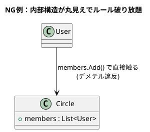
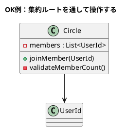
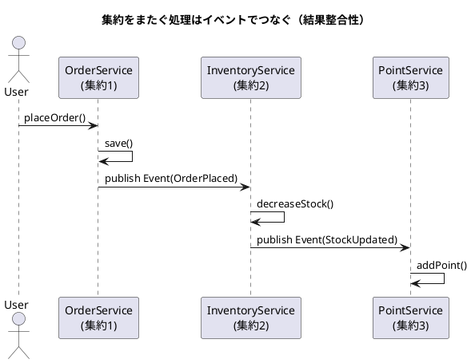

了解しました！  
では **「NotebookLM用 読書ノート（Deep Dive 章：集約 / Aggregate）」** を作成します。  
あなたの語り口（The Deep Dive のトーン）を保ちつつ、学習に最高の形に整え、さらに **PlantUML 図解付き** でまとめます。

---

# 📘 NotebookLM 読書ノート

## Deep Dive：DDD「集約（Aggregate）」編

（元テキスト：あなたが投稿した対話ベースの長文解説）

---

# 🧩 **一言まとめ（TL;DR）**

> **集約は、ビジネスルールを外の世界から守る“金庫の番人”であり、  
> 破壊的な副作用を防ぎ、ソフトウェアを長期間健全に保つための境界線である。**

---

# 🎯 **この章のキーアイデア**

### **1. 集約は「境界（Boundary）」＋「ルート（Root）」で成り立つ**

- 境界：保護されるべきルールのまとまり
    
- ルート：唯一の入り口（窓口）
    
- 外部は“直接触れない”仕組みによってルール逸脱を構造的に防ぐ
    

---

### **2. 「直接触るな」＝ デメテルの法則（Law of Demeter）**

- `Circle.Members.Add(user)`  
    → **禁止（直接触れたらルールを破れる）**
    
- `Circle.joinMember(user)`  
    → **正しい（番人＝集約ルートが制御）**
    

---

### **3. ルールを散らすな → “一箇所だけに集約しろ”**

- 最悪のアンチパターン：  
    「最大30名」なのにコードに **29** と書いている
    
- 変更漏れの地獄・時間爆弾（後で必ず爆発する）
    

→ ルールは **必ず集約内の1箇所に閉じ込める**。

---

### **4. 集約を巨大にするとロック地獄が起きる**

- 更新範囲が広がるとDBロックも広がる
    
- 性能悪化につながる
    

→ **集約は小さく保て**が鉄則

---

### **5. 集約間を跨ぐ処理は「結果整合性」で扱う**

- SNSの「いいね」
    
- ECサイトの注文・在庫・ポイント
    
- 完全同期ではなく、“最終的に辻褄が合っていればOK”
    

→ モダンシステムのほとんどがこの方式

---

### **6. ID参照にすることで境界を強制できる**

- サークルがユーザー一覧を **実体で持つのはNG**
    
- **IDのリストを持つ**  
    → “うっかり操作”が物理的に不可能になる
    

---

# 📝 **PlantUML 図解：この章で理解すべき構造**

※ NotebookLM は PlantUML を画像化するので、そのまま貼って使えます。

---

## **① 集約の基本構造（ルートが唯一の入り口）**

---

## **② 悪い例：外部から内部リストを直接触る（破綻する世界）**

---

## **③ 良い例：必ず集約ルートを通る（番人が保護）**

---

## **④ 結果整合性の世界（集約はまたげない → 非同期イベントで連携）**

---

# 💡 **この章の“いい比喩”トップ3**

|No|比喩|何を説明しているか|
|---|---|---|
|1|**銀行の窓口係**|集約ルートだけが操作を許可する|
|2|**金庫の番人**|ルールを外部から遮断する役割|
|3|**糸を1本引くと全体が崩れる**|ルールが散らばるとシステムが脆くなる|

---

# 🤝 **印象的なQ&A（あなたと“相棒”のやりとり要約）**

### **Q. なんで直接代入を禁止するの？**

**A.** ルール違反が“一瞬で”システム全体に広がるから。

---

### **Q. 集約をどこまで大きくすればいい？**

**A.** トランザクション境界で考える。「一貫性を保つべき最小の塊」が集約。

---

### **Q. 複数の集約を同期させるには？**

**A.** 基本NG。必要ならイベントを使って「結果整合性」で処理する。

---

### **Q. なぜ ID 参照なの？**

**A.** 実体参照にすると、境界を“すり抜けられる”から。

---

# 🧭 **自分がやる 3つ（Action Items）**

### **1. ルールをコード内の1箇所に閉じ込める**

- “29” のような数字は絶対に外へ漏らさない
    
- 集約内のメソッドで一元管理する
    

---

### **2. コードから「直接触る」実装を消す**

- `.Members.Add()` を全禁止
    
- 必ず `joinMember()` のようなメソッドを作る
    

---

### **3. 集約の境界を見直す**

- “一貫性を絶対に守る必要があるデータ”  
    だけを1つにまとめる
    
- 他は ID 参照で切り離す
    

---

# 🏁 **次章につながる問い**

> **あなたが普段使っている SNS や通販サイトで、  
> “結果整合性”が静かに働いているのはどこでしょう？**

---

必要なら、このノートを **MDファイルとして書き出す版** や  
**NotebookLM に最適化した「読み込み用プロンプト」** も作れます。

続けますか？