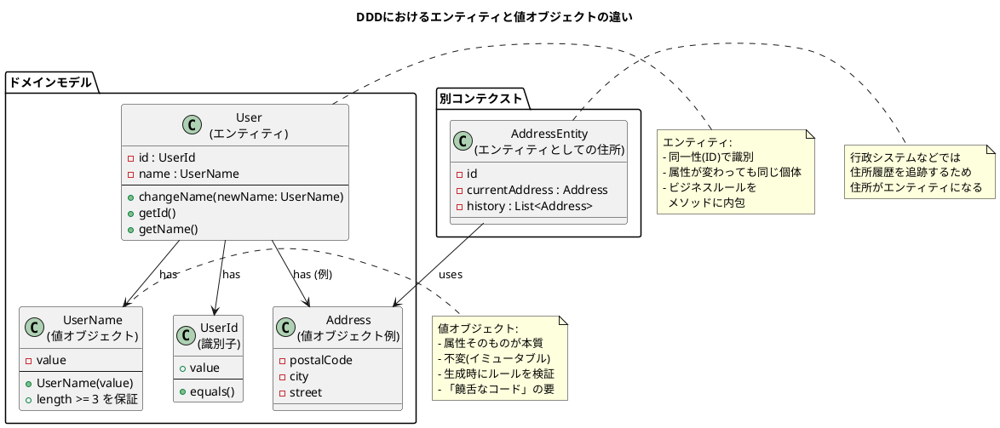

① この音声の一言まとめ  
この章は、DDDにおける「エンティティ」とは何かを、値オブジェクトとの違い・ER図との違い・ライフサイクルとコンテクスト・饒舌なコードと無口なコードといった切り口から深掘りし、「時間を通じた同一性」と「ビジネスルールを内包した設計」が変化に強いソフトウェアにつながることを示した内容です。

---

② キーアイデア（3〜5個）

- **エンティティは「属性」ではなく「同一性（ID）」で識別される存在**  
    値オブジェクトは“属性そのもの”が本質（氏名が変われば別の値）。  
    一方エンティティは、属性が変わっても同じであり続ける「時間を通じた同一性」を持つ（ユーザー名が変わっても同じユーザー）。  
    プログラム上では、変わらない識別子（ユーザーIDなど）によってその同一性を表現する。
    
- **DDDのエンティティは“ER図のエンティティ”とは目的が違う**  
    ER図のエンティティは「データを矛盾なく効率よく保存する」ための構造。  
    DDDのエンティティは、「ビジネスルールと振る舞いをどう表現するか」にフォーカスした存在。  
    単なるデータの箱ではなく、「ルールを内包したオブジェクト」であることが重要。
    
- **エンティティは“変更可能”だが、なんでも書き換えてよいわけではない**  
    `public string Name { get; set; }` のような無防備な入れ物にしてしまうと、誰でも・どこからでも・どんな値にも変更できてしまう。  
    DDDでは「名前を変更する」という意味のある行為をメソッドにし、その中に「ユーザー名は3文字以上」などのビジネスルールを埋め込むことで、ルールに守られた変更だけを許可する。
    
- **ライフサイクルとコンテクストが“値オブジェクトかエンティティか”の判断軸になる**  
    その概念の「誕生〜死」までを追跡する必要があるか？が重要な基準。  
    ECサイトでは住所は「今の住所」だけ分かればよく、履歴は不要 → 値オブジェクト扱いが自然。  
    住民票システムでは住所の履歴が本質的 → 履歴を追うエンティティになる。  
    タイヤも、ドライバー視点なら値オブジェクト、工場視点ならエンティティになるように、コンテクストによって役割は変わる。
    
- **饒舌なコードは“ルールを語るコード”、無口なコードは“バグを生む沈黙”**  
    無口なコード：あちこちに同じバリデーション（3文字以上）が散らばり、仕様変更（3→6文字）時に修正漏れを起こす。  
    饒舌なコード：`UserName` クラスが「3文字以上でなければ生成できない」と主張しているため、変更箇所は1つで済み、安全。  
    エンティティ／値オブジェクトにビジネスルールを集約するほど、変更に強くなる。
    

---

③ NotebookLMならではの“いい比喩・表現”

- **「5歳の頃と今では全然違うけど、紛れもなく同じ“あなた”」**  
    → エンティティの「時間を通じた同一性」を、直感的に説明する比喩。
    
- **「システムだけが知っている背番号」**  
    → ユーザーIDのような識別子が、属性とは別の次元で同一性を管理していることを表現。
    
- **「データを入れるただの箱 vs ルールを持った存在」**  
    → 同じ“クラス”でも、単なるDTOとDDDのエンティティの違いを強調する表現。
    
- **「タイヤの例：ドライバーにとっては交換可能な部品、工場にとっては追跡すべき個体」**  
    → 同じ対象でもコンテクストによって値オブジェクトにもエンティティにもなり得ることを示す印象的な例。
    
- **「饒舌なコードと無口なコード」**  
    → ルールを語るコードと沈黙しているコードの違いを、人格を与えて説明するフレーズ。
    

---

④ 印象的なQ&A（2〜5組）

**Q: DDDのエンティティと、データベースのER図のエンティティは何が違うの？**  
A: 見た目は似ているが、目的が根本的に違う。  
　ER図は「どう保存するか（格納・整合性）」にフォーカスしているのに対し、  
　DDDのエンティティは「どんなルール・振る舞いを持つべきか（ビジネスロジック）」に焦点を当てている。

---

**Q: 可変である、って“ただ書き換え可能”という意味？**  
A: そうではない。  
　DDDのエンティティにおける可変性は「ルールに守られた変更ができる」という意味。  
　`ChangeName` メソッドなど、意味のある操作の中でのみ状態を変えることで、不正な変更を防ぐ。

---

**Q: 値オブジェクトとエンティティの境界が曖昧に感じるとき、どう判断すればいい？**  
A: 「ライフサイクルを追跡したいか」「どのコンテクストで扱っているか」を基準に考える。  
　履歴や変遷を追う必要があればエンティティ候補、  
　“その時点の値だけわかればよい”なら値オブジェクト候補。  
　同じ住所でも、ECサイトと住民票システムでは役割が変わる。

---

**Q: なぜわざわざこんな面倒な区別をする必要があるの？**  
A: 区別せず「何でもただのデータクラス」にすると、ビジネスルールがコード全体に分散し、  
　仕様変更のたびに大量の修正＆修正漏れリスクが発生するから。  
　エンティティ／値オブジェクトにルールを集約して“饒舌なコード”にすると、  
　変更点が局所化され、変化に強いシステムになる。

---

⑤ 自分が実際にやってみること（最大3つ）

- **自分のプロジェクトで「本当にライフサイクルを追跡したいもの」をリストアップしてみる**  
    ユーザー、注文、契約など、「誕生〜変更〜終了」を追いたいものを挙げて、エンティティ候補として整理する。
    
- **“無口なコード”になっているクラスを一つ選び、“饒舌なコード”にリファクタしてみる**  
    例えば `User` や `UserName` を取り上げて、  
    `string` プロパティ＋バリデーション散乱 → ルールを内包した値オブジェクト／メソッドに変えてみる。
    
- **値オブジェクトかエンティティか迷う概念（住所・商品属性など）を、コンテクスト別に書き分けてみる**  
    「ECサイトならこう扱う」「行政システムならこう扱う」と、  
    システムごとにモデルがどう変わるかをノートに書いて、自分の中の判断軸を明確にする。
    

---

⑥ PlantUMLでの図解

エンティティと値オブジェクトの違い、IDによる同一性、ライフサイクルとコンテクスト、  
そして“饒舌なコード”としてルールをエンティティ側に集約するイメージを図にしました。

この図をベースに、

- 自分のプロジェクトの `User` / `Order` / `Address` などを当てはめてみる
    
- どこにルールを置くべきかを書き込んでみる
    

と、エンティティ設計のイメージがかなりクリアになるはずです。