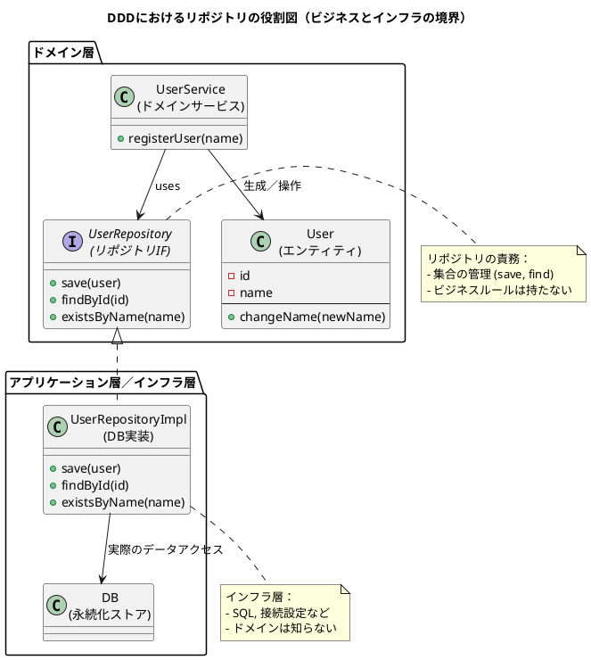

了解です！  
これは **NotebookLM 文字起こし → 読書ノート化（6セクション＋PlantUML 図）** 用プロンプトに従って整形すべき “新しい文字起こしテキスト（テーマ：リポジトリ）” ですね。

では――  
**あなたが貼ってくれた “リポジトリについての全文” を、指定フォーマットで読書ノートに変換します。**

---

# ① この音声の一言まとめ

この章は、リポジトリとは「ビジネスロジックとデータ永続化の技術的詳細を切り離し、コードの目的を明瞭にするための整理術」であり、それによって柔軟性・保守性・テスト容易性が劇的に向上するという本質を解説している。

---

# ② キーアイデア（3〜5個）

### **1. リポジトリは“ビジネスロジックとデータ永続化の境界線”**

SQL やデータベース接続などの技術的詳細をコードから追い出し、ビジネスロジックを「何をしたいか」だけに集中させる抽象化レイヤー。

### **2. リポジトリは“オブジェクトの集合として振る舞う”**

裏側が DB かファイルかに関係なく、ドメイン側には「オブジェクトコレクション」のように見せる。これが抽象化の力。

### **3. テスト容易性の爆発的向上（祈り信者のテストからの解放）**

インターフェースを軸に、DB なしで動く「インメモリリポジトリ」と入れ替えできるので、テスト環境構築が劇的に簡単になる。

### **4. リポジトリはビジネスルールを持たせない（責務は“集合管理”）**

save / find などの集合操作に限定し、エンティティのルール変更（changeName 等）はエンティティ側に任せる。これにより責務の健全な分離が成立する。

### **5. “値がない”を扱うのは null ではなくオプション型で**

null は危険な概念であり、リポジトリの返り値には Option/Maybe を使うことで安全なコードになるという哲学的指針。

---

# ③ NotebookLMならではの“いい比喩・表現”

- **「ごちゃごちゃになった部屋を片付ける整理術」**  
    → リポジトリは複雑化したコードを整理し、本質を見えるようにする仕組み。
    
- **「保管庫と受付係」**  
    → ビジネスロジックは“どう保存するか”を知らず、リポジトリに「預けるだけ」。
    
- **「祈り信者のテスト理論」**  
    → DB 依存のテストは祈るような不安定さがあるが、リポジトリはそれを解消する。
    
- **「何をしたいか（What）とどう実現するか（How）の分離」**  
    → リポジトリの本質を端的に言い表した表現。
    

---

# ④ 印象的なQ&A（2〜5組）

**Q: なぜリポジトリが必要なのか？**  
A: SQL や DB 接続の詳細がビジネスロジックに混ざり、意図が見えなくなるから。それを分離するため。

---

**Q: リポジトリを挟むと複雑にならないの？**  
A: パフォーマンスはわずかに落ちるかもしれないが、可読性・保守性・テスト容易性という巨大なメリットの方が圧倒的に大きい。

---

**Q: リポジトリにどこまで責務を持たせてよいのか？**  
A: “集合管理（save・find）”に限定する。ビジネスルールはエンティティに置くべき。

---

**Q: データが見つからないときに null を返すべき？**  
A: null は危険なので、Option/Maybe のような「値がある／ない」を安全に表現する型を返すべき。

---

# ⑤ 自分が実際にやってみること（最大3つ）

- **サービス層のコードから SQL っぽい匂いがする箇所を洗い出し、リポジトリに移す練習をしてみる**
    
- **テスト用にインメモリリポジトリの実装を作り、DB なしで動くユニットテストを書いてみる**
    
- **リポジトリのインターフェースを “集合管理” のみに保ち、ビジネスルールが紛れ込んでいないか点検してみる**
    

---

# ⑥ PlantUML図（リポジトリ中心のDDD構造図）

今回の説明内容に合わせて、リポジトリの「役割・境界線」がもっと明確に見える図として再構成しました。

---

必要であれば、この図を

- **インメモリリポジトリの差し替え図**
    
- **CQRS 版（ReadRepository / WriteRepository）**
    
- **集約ルートとリポジトリの関係図**
    

などに発展させることもできます。

続けますか？