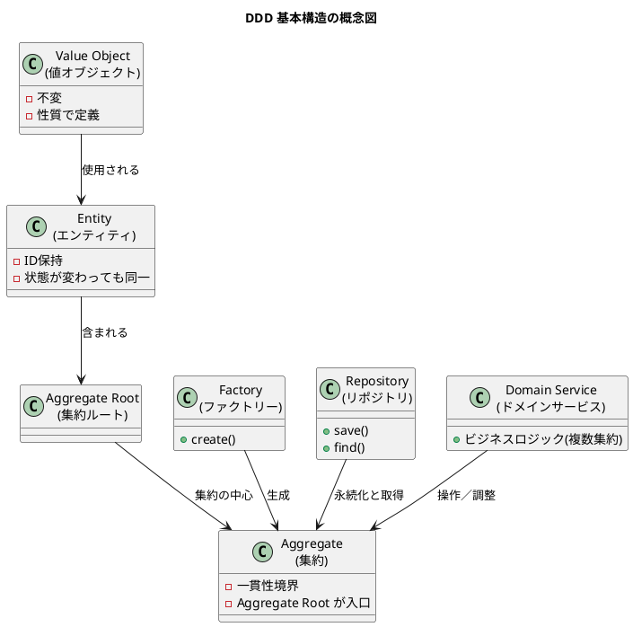

![[DDD_1.png]]

![[Building_Intentional_DDD.pdf]]
# ① この音声の一言まとめ

この章は、DDDの“難しそうな専門用語（幽霊）”の正体を、値オブジェクト・エンティティ・集約・ファクトリー・リポジトリ・ドメインサービス・ユビキタス言語という具体的な道具として理解し、最終的には「ビジネスの物語をコードで語る」ための共通言語を築くことがDDDの目的であると示した内容。

---

# ② キーアイデア（3〜5個）

### **1. DDDの専門用語は“幽霊ではなく便利な道具”**

多くの初学者がDDDを怖がるのは、正体不明の専門用語が並ぶため。しかし意味を知れば、複雑なビジネスを整理するための優れたツールである。

### **2. 値オブジェクトは“副作用バグを消すための武器”**

値オブジェクトは不変性を持つ「性質で定義されるもの」。  
例えば `Price` を数値ではなくオブジェクトとして扱うことで、意図しない書き換えに起因するバグを構造的に防げる。

### **3. エンティティと集約は“同一性と整合性の番人”**

エンティティはIDによって同一性を持つ可変オブジェクト。  
集約は、関連するエンティティや値オブジェクトをまとめ一貫性を守る「保護バブル」。  
注文などの複雑な構造を一箇所で整合的に扱える。

### **4. ファクトリーとリポジトリは“現場のカオスを隔離する”**

ファクトリーは複雑な生成処理を引き受ける専用ライン。  
リポジトリはビジネスロジックとデータ永続化の詳細を隔離する壁で、ドメインモデルをクリーンに保つ。

### **5. ドメインサービスとユビキタス言語こそがDDDの真の中心**

単一のオブジェクトに属さない振る舞いはドメインサービスに切り出す。  
DDDの最終ゴールは、ビジネス現場の用語とコード中の用語を完全に一致させる「ユビキタス言語の構築」。

---

# ③ NotebookLMならではの“いい比喩・表現”

- **「幽霊の正体見たり枯れ尾花」**  
    → 正体を知れば専門用語は怖くない、ただの道具になる。
    
- **「値オブジェクトは処方箋」**  
    → 副作用バグという“病気”を根本から取り除く手段という意味。
    
- **「集約は保護バブル（境界）」**  
    → 注文や顧客といったビジネスルールが破壊されないよう、内部を守る構造。
    
- **「ファクトリーは専門の組み立てライン」**  
    → 複雑な生成処理をまとめて扱う仕組みをわかりやすく比喩。
    
- **「リポジトリはファイアウォール」**  
    → ドメインから永続化技術を隔離し、ビジネスロジックを守る壁。
    

---

# ④ 印象的なQ&A（2〜5組）

**Q: なぜDDDの専門用語は初心者を圧倒するのか？**  
A: 正体がわからないまま大量に出てくるため“幽霊”のように見える。理解すれば単なる便利な道具。

---

**Q: 値オブジェクトはどんな問題を解決する？**  
A: 変数があちこちで書き換わり、意図せぬ副作用が発生するバグを根本から防ぐ。

---

**Q: 注文明細だけ変更して合計金額が更新されない問題はどう解決する？**  
A: 注文を集約として扱い、数量変更と再計算の一貫性を集約ルートが責任を持って管理する。

---

**Q: 銀行送金のようにどのエンティティにも属しない振る舞いはどこに書く？**  
A: ドメインサービスとして切り出す。複数集約をまたぐ処理を自然に表現できる。

---

**Q: DDDの最終的な目的は？**  
A: パターンの暗記ではなく、ビジネスとコードが同じ言語＝ユビキタス言語で語られる状態を作ること。

---

# ⑤ 自分が実際にやってみること（最大3つ）

- **値オブジェクトにできそうな型を探してラップしてみる**（Price, Email, Quantityなど）
    
- **自分のシステムで“どこが集約ルートか”を書き出して整理してみる**
    
- **コードのクラス名をビジネス担当者に読んでもらう想定で見直し、ユビキタス言語のズレを探す**
    

---

# ⑥ PlantUMLでの図解

以下は、音声で説明されたDDDの基本要素（値オブジェクト・エンティティ・集約・ドメインサービス・リポジトリ）の関係を簡易に表した図です。

---

