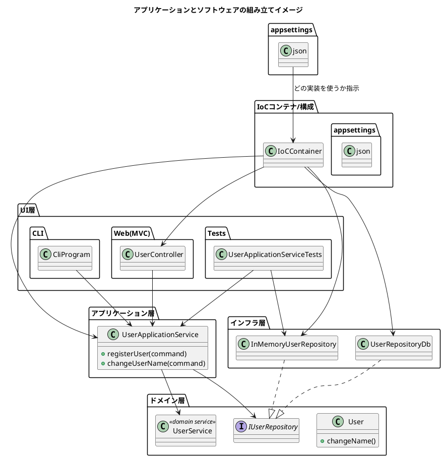

今回の回、めちゃくちゃ良かったので、いつもの「読書ノート＋図」でまとめますね。

---

## ① 一言でいうと…

**「アプリケーション（心臓部）とUI（見た目＆入り口）をきっちり分けて、  
IoCコンテナ＋DIで組み立てると、“UI着せ替え自由＆テストしやすい”長生きソフトウェアになる**  
…という話でした。

---

## ② 今日出てきたキーワードの関係

### 1. アプリケーション vs ソフトウェア

- **アプリケーション**  
    = ドメインの問題を解決する「心臓部」
    
    - ユースケースを実現するアプリケーションサービス
        
    - ドメインモデル（エンティティ / 値オブジェクト / ドメインサービス）
        
    - リポジトリ（抽象）
        
- **ソフトウェア**  
    = アプリケーション ＋ UI（CLI / Web / テストなど）
    
    - CLIでもWebでもテストコードでも、**同じアプリケーションを“呼び出す側”**にすぎない
        

→ だから「UIは着せ替え人形」にしておけるかどうかが、長期的な寿命をかなり左右する。

---

### 2. IoCコンテナは「依存関係の管理人」

- 役割：**「newする責任」を全部一箇所に集約する人**
    
    - `IUserRepository` が欲しいと言われたら「これを渡す」と最初に登録しておく
        
    - 各クラスは「自分は `IUserRepository` が必要です」と **コンストラクタで宣言するだけ**
        

#### Lifetimeの話（AddSingleton vs AddTransient）

- `AddSingleton<IUserRepository, InMemoryUserRepository>()`
    
    - メモリ上のリストでユーザを管理 → **1個だけにしないとデータが消える**
        
- `AddTransient<UserApplicationService>()`
    
    - サービスは**毎回新品（使い捨てコップ）**のほうが安全・シンプル
        
    - 余計な状態を持たない＝バグりにくい
        

#### スタティックとの違い

- `static` は「**この実装そのもの**に固定」される（差し替え困難）
    
- IoCのシングルトンは「**この役割（IUserRepository）を1個にする**」だけ  
    → **実装（InMemory / DB）はいつでも入れ替え可能**
    

---

### 3. CLI → Web → テストで「同じ心臓」を使い回す

1. **CLI版**
    
    - `Main` で IoC コンテナに登録 → `UserApplicationService` を取り出して使う
        
    - IoCの登録だけ差し替えて、メモリ版→DB版に切り替え可能
        
    - UIが黒い画面なだけで、中身は本番と同じアプリケーション
        
2. **Webアプリ（ASP.NET Core MVC）の場合**
    
    - 起動時に `Startup`（または Program.cs）で **依存関係を全部登録**
        
    - HTTPリクエスト → ルーティング → コントローラ生成のときに  
        IoCコンテナが「必要なもの（サービス）を注入」してくれる
        
    - 開発用 / 本番用の設定は **別ファイルに分けて、appsettings.json でどっちを使うか指定**  
        → コードを変えずに環境だけ切り替えられる
        
3. **ユニットテスト**
    
    - `UserApplicationService` に **`InMemoryUserRepository` を直接注入**してテスト
        
    - DB不要、一瞬で動く、テストが独立していて壊れにくい
        
    - テスト専用に `InMemoryUserRepository.Store` を公開するのは  
        「テストだけ心臓音を聴く特別な聴診器」と考えればOK（本体コードからは見えない）
        

---

### 4. UI層（コントローラー）は「ゲーム機のコントローラー」

- 仕事は **HTTPリクエスト → コマンドオブジェクトへの変換** だけ
    
- それ以上のロジック（if地獄、ビジネスルール）は **ドメイン / アプリケーションサービス側に置くべき**
    
- コントローラのコードが
    
    - 「退屈」「薄い」「単純なデータ詰め替えだけ」に見えたら大成功
        
    - 逆に賢く見え始めたら危険信号（UIにロジックが漏れてる）
        

---

### 5. 怪談：UIにドメインロジックをべったり書くとどうなるか

- ASP.NET WebForms 時代のレガシーシステム：
    
    - すべてのビジネスロジックが **Button_Click の中** に直書き
        
    - 画面ごとに微妙に違うコピペロジックが群生
        
    - テストもドキュメントもない
        
    - WebForms → MVC への移行時に「読んで仕様を推測して全部作り直し」しかなかった
        
- 教訓：
    
    - 「UIを変える予定なんてない」と思っていても  
        技術の寿命が先に尽きて、**UI強制リプレイスが必ず来る**
        
    - そのときに **ドメインがUIに埋まっていると、システムごと心中** する羽目になる
        

---

## ③ 全体像の図（UI着せ替え＆テストまで含めて）

---

## ④ あなたのプロジェクトに落とすときの「次の一歩」

ざっくりでもいいので、こんな感じでやると良さそうです：

1. **「アプリケーションの心臓」と「UI」を紙に書いて分けてみる**
    
    - どのクラスが「心臓」（ユースケース）で  
        どのクラスが「入り口」（コントローラ / ページ）かをラフに整理
        
2. **心臓が直接 `new` している「技術依存のクラス」を探す**
    
    - DBクライアント、HTTPクライアント、ファイルI/O など
        
    - そこに `I◯◯Repository` / `I◯◯Client` みたいなIFをかませて、  
        まずは 1 本だけ DDDっぽい「縦の筋」を通してみる
        
3. **その1本を、CLI or 小さなテストで呼び出してみる**
    
    - UIは雑でOK。とにかく「心臓だけで動く」ラインを1本作る
        
    - ここまでできると「UI着せ替え」「InMemoryテスト」が体感でイメージしやすくなるはず
        

---

最後の問いへの返しとしては：

> 「このビジネスルールは絶対変わらない」と自分が信じている場所ほど、  
> いざ変わるときに一番ダメージがデカいので、  
> **そこを中心に“UIから切り離しておく”のがサバイバル戦略**

って感じですね。

もし「じゃあ自分の◯◯プロジェクトだとどう分ければいいか一緒に見て」みたいなのがあれば、  
実際の構成（ざっくりクラス名や層のイメージ）を投げてくれれば、一緒にDDD風リファクタの第一歩まで落とし込みます。