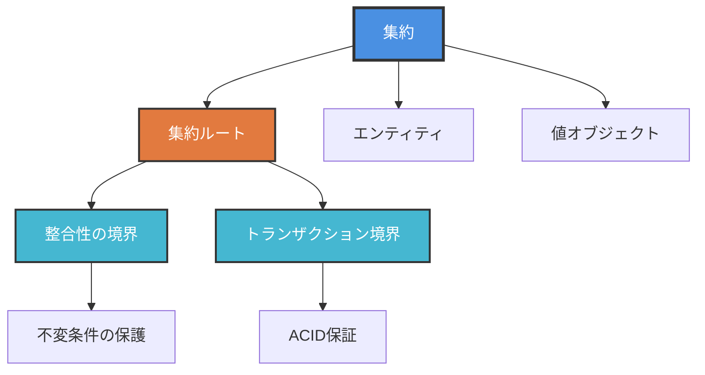
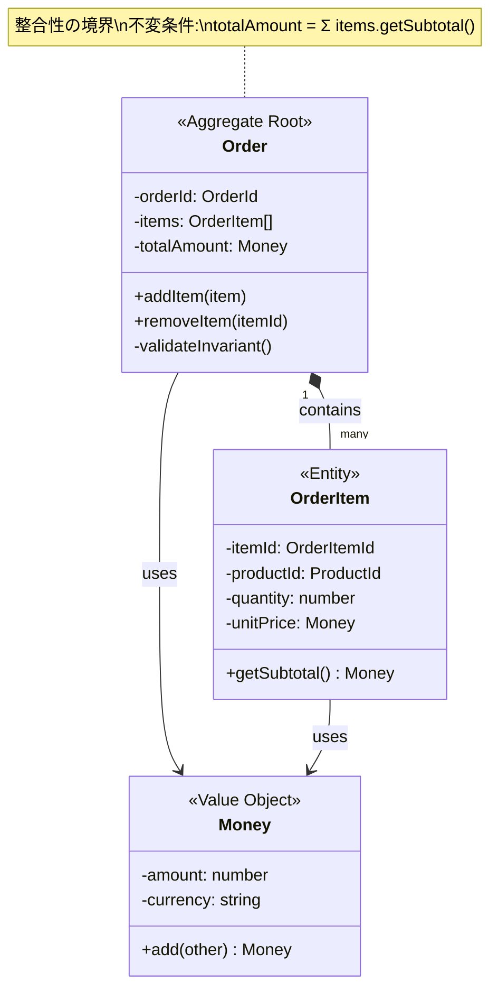
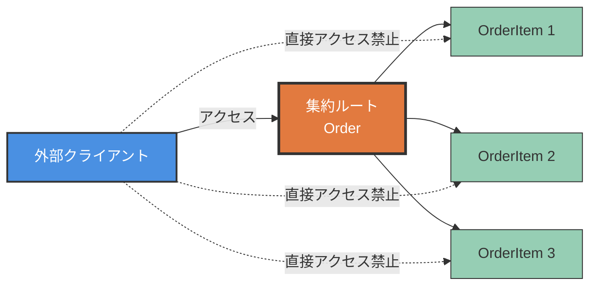
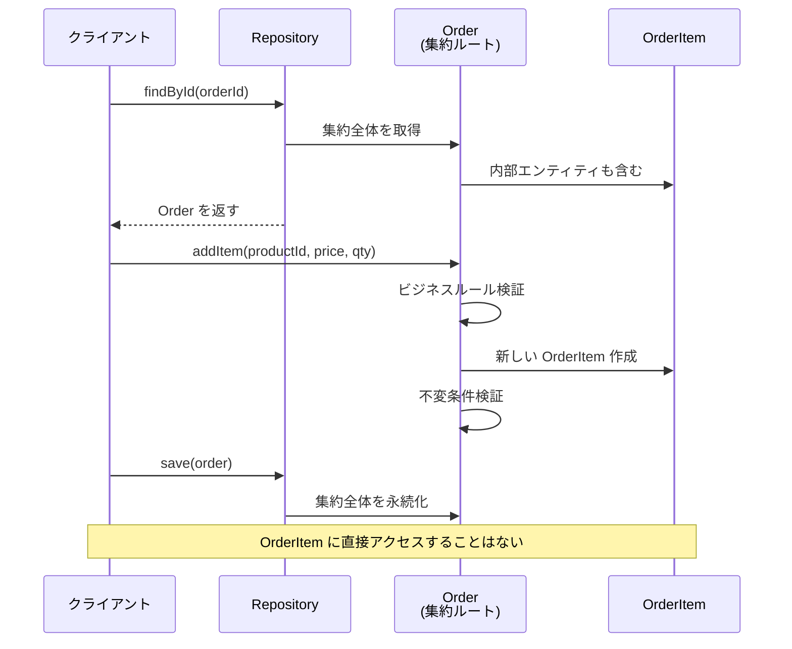
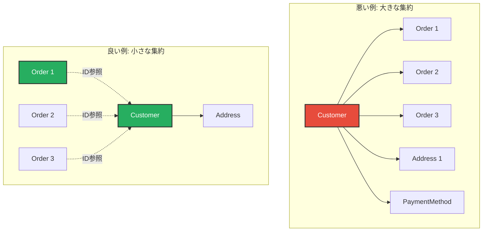
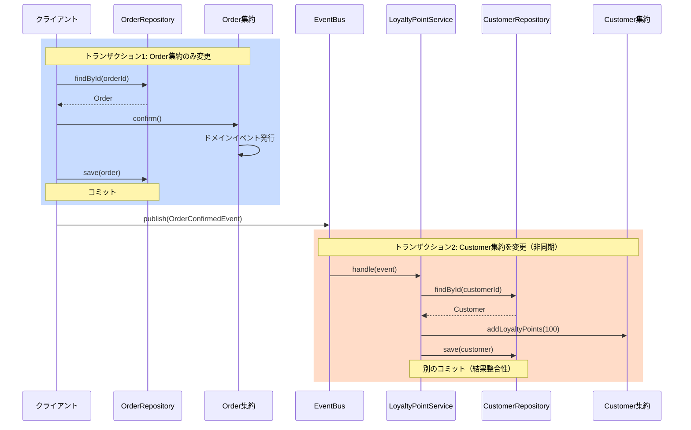
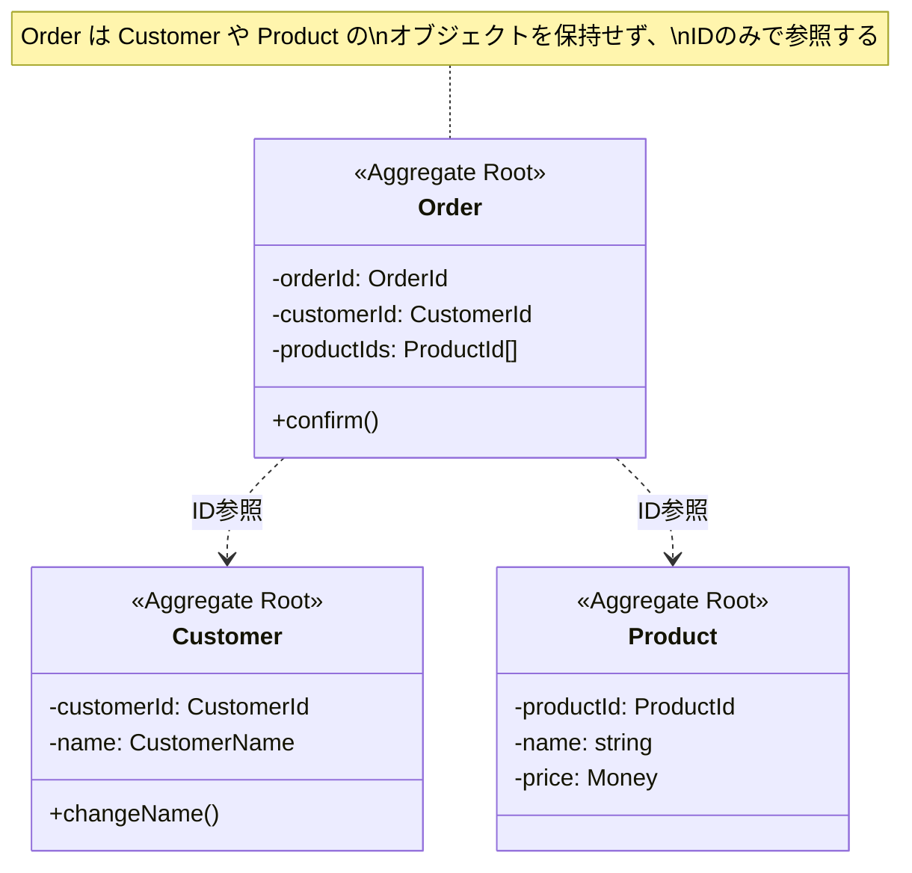

# Ticket 016: Frontend1 - Chapter 8 集約

## 担当タスク

Chapter 8「集約」の3レッスンと各レッスン5問のクイズを作成する。

## 実装要件

### ファイル構成

```
src/data/
  sampleLessons.ts     // chapter8Lessons を追加
  sampleQuizzes.ts     // chapter8Quizzes を追加
  sampleCourses.ts     // chapter8 を追加
```

## Lesson 8-1: 集約とは

### コンセプト

集約は整合性の境界を定義し、ドメインの不変条件を保護する。トランザクション境界として機能し、一貫性のあるデータ変更を保証する。

### 学習目標

- 集約の定義と目的を理解する
- 整合性の境界の重要性を理解する
- 不変条件の保護方法を理解する
- トランザクション境界としての役割を理解する

### コンテンツ構成

1. **集約の定義**
   - 関連するオブジェクトの集まり
   - 整合性の境界として機能
   - 一つの単位として扱われる
   - ライフサイクルを共有する

2. **整合性の境界**
   - 集約内の一貫性保証
   - 集約外は結果整合性
   - ビジネスルールの保護
   - 不変条件の強制

3. **不変条件（Invariant）**
   - 常に真でなければならないルール
   - ビジネスロジックの表現
   - 集約が保護する
   - 例: 注文の合計金額 = 明細の合計

4. **トランザクション境界**
   - 1トランザクション = 1集約
   - ACID特性の保証範囲
   - データベース操作の単位
   - ロック範囲の最小化

### TypeScriptコード例

```typescript
// 悪い例: 整合性の境界が不明確
class Order {
  items: OrderItem[] = [];
  totalAmount: number = 0;

  // 問題: items と totalAmount の整合性が保証されない
  addItem(item: OrderItem) {
    this.items.push(item);
    // totalAmount の更新を忘れる可能性がある
  }
}

// 良い例: 集約として整合性を保護
class Order {
  private items: OrderItem[] = [];
  private _totalAmount: number = 0;

  get totalAmount(): number {
    return this._totalAmount;
  }

  addItem(item: OrderItem) {
    // 不変条件のチェック
    if (item.quantity <= 0) {
      throw new Error('数量は1以上である必要があります');
    }

    this.items.push(item);
    this._totalAmount += item.getSubtotal();

    // 不変条件の保証: totalAmount は items の合計と一致する
    this.validateInvariant();
  }

  private validateInvariant() {
    const calculatedTotal = this.items.reduce(
      (sum, item) => sum + item.getSubtotal(),
      0
    );

    if (calculatedTotal !== this._totalAmount) {
      throw new Error('注文の整合性が破綻しています');
    }
  }
}

class OrderItem {
  constructor(
    public readonly productId: string,
    public readonly unitPrice: number,
    public readonly quantity: number
  ) {}

  getSubtotal(): number {
    return this.unitPrice * this.quantity;
  }
}
```

### Mermaid図解

#### 図1: 集約の概念図


#### 図2: 整合性の境界


### クイズ（5問）

1. **集約の主な目的は何ですか？**
   - A) パフォーマンスの最適化
   - B) コードの再利用性向上
   - **C) 整合性の境界を定義し、不変条件を保護する** ✓
   - D) データベーステーブルのマッピング

2. **集約におけるトランザクション境界の原則は？**
   - **A) 1つのトランザクションで1つの集約のみを変更する** ✓
   - B) 1つのトランザクションで複数の集約を変更する
   - C) トランザクションは集約と無関係
   - D) 集約はトランザクションを使わない

3. **不変条件（Invariant）とは何ですか？**
   - A) 変更できない変数
   - **B) 常に真でなければならないビジネスルール** ✓
   - C) データベースの制約
   - D) 初期化時のみ有効なルール

4. **集約内の整合性と集約間の整合性の違いは？**
   - A) 両方とも即座に整合性を保証する
   - **B) 集約内は即座、集約間は結果整合性** ✓
   - C) 両方とも結果整合性
   - D) 違いはない

5. **集約が保護すべき整合性の例として適切なのは？**
   - A) ユーザーテーブルのインデックス
   - B) データベースの正規化
   - **C) 注文の合計金額が明細の合計と一致すること** ✓
   - D) ファイルシステムの権限

---

## Lesson 8-2: 集約ルート

### コンセプト

集約ルートは集約の入口として、外部からのアクセスを制御する。集約内の整合性を保証し、不変条件を維持する責任を持つ。

### 学習目標

- 集約ルートの役割を理解する
- 外部アクセス制御の重要性を理解する
- 集約ルートの実装パターンを習得する
- カプセル化の重要性を理解する

### コンテンツ構成

1. **集約ルートの定義**
   - 集約への唯一の入口
   - 外部から直接アクセス可能
   - 整合性の保護責任
   - グローバルな識別子を持つ

2. **外部アクセス制御**
   - 集約内のエンティティへの直接アクセス禁止
   - すべての操作は集約ルート経由
   - カプセル化の徹底
   - 不変条件の一元管理

3. **実装パターン**
   - private コレクションの使用
   - 読み取り専用プロパティ
   - 集約ルートのメソッド経由での変更
   - 防御的コピー

4. **リポジトリとの関係**
   - リポジトリは集約ルートのみを扱う
   - 永続化の単位
   - 取得の単位
   - 削除の単位

### TypeScriptコード例

```typescript
// 悪い例: 集約内のエンティティに直接アクセス可能
class Order {
  public items: OrderItem[] = [];

  // 問題: 外部から items を直接操作できてしまう
}

// 使用例（問題あり）
const order = new Order();
order.items.push(new OrderItem(/* ... */)); // 不変条件がチェックされない
order.items[0].quantity = -1; // 不正な値を設定できてしまう

// 良い例: 集約ルートがアクセスを制御
class Order {
  private readonly _orderId: OrderId;
  private readonly _items: OrderItem[] = [];
  private _totalAmount: Money;
  private _status: OrderStatus;

  constructor(orderId: OrderId) {
    this._orderId = orderId;
    this._totalAmount = Money.zero();
    this._status = OrderStatus.Draft;
  }

  get orderId(): OrderId {
    return this._orderId;
  }

  get totalAmount(): Money {
    return this._totalAmount;
  }

  get status(): OrderStatus {
    return this._status;
  }

  // 読み取り専用のコピーを返す
  getItems(): ReadonlyArray<OrderItem> {
    return [...this._items];
  }

  // すべての変更は集約ルート経由
  addItem(
    productId: ProductId,
    unitPrice: Money,
    quantity: number
  ): void {
    // ビジネスルールのチェック
    if (this._status !== OrderStatus.Draft) {
      throw new Error('確定済みの注文は変更できません');
    }

    if (quantity <= 0) {
      throw new Error('数量は1以上である必要があります');
    }

    // 新しい OrderItem を作成
    const itemId = OrderItemId.generate();
    const item = new OrderItem(itemId, productId, unitPrice, quantity);

    this._items.push(item);
    this._totalAmount = this._totalAmount.add(item.getSubtotal());

    // 不変条件の検証
    this.validateInvariant();
  }

  removeItem(itemId: OrderItemId): void {
    if (this._status !== OrderStatus.Draft) {
      throw new Error('確定済みの注文は変更できません');
    }

    const index = this._items.findIndex(item =>
      item.itemId.equals(itemId)
    );

    if (index === -1) {
      throw new Error('指定された明細が見つかりません');
    }

    const item = this._items[index];
    this._totalAmount = this._totalAmount.subtract(item.getSubtotal());
    this._items.splice(index, 1);

    this.validateInvariant();
  }

  confirm(): void {
    if (this._items.length === 0) {
      throw new Error('明細のない注文は確定できません');
    }

    if (this._status !== OrderStatus.Draft) {
      throw new Error('すでに確定済みです');
    }

    this._status = OrderStatus.Confirmed;
  }

  private validateInvariant(): void {
    const calculatedTotal = this._items.reduce(
      (sum, item) => sum.add(item.getSubtotal()),
      Money.zero()
    );

    if (!calculatedTotal.equals(this._totalAmount)) {
      throw new Error('注文の整合性が破綻しています');
    }
  }
}

// OrderItem は外部から直接インスタンス化できないようにする
class OrderItem {
  constructor(
    public readonly itemId: OrderItemId,
    public readonly productId: ProductId,
    public readonly unitPrice: Money,
    public readonly quantity: number
  ) {
    // Order からのみ呼び出されることを想定
  }

  getSubtotal(): Money {
    return this.unitPrice.multiply(this.quantity);
  }
}

// リポジトリは集約ルートのみを扱う
interface OrderRepository {
  save(order: Order): Promise<void>;
  findById(orderId: OrderId): Promise<Order | null>;
  delete(order: Order): Promise<void>;
  // OrderItem を直接扱うメソッドは存在しない
}
```

### Mermaid図解

#### 図1: 集約ルートの役割


#### 図2: 集約ルートとリポジトリ


### クイズ（5問）

1. **集約ルートの主な責任は何ですか？**
   - A) データベースへの接続管理
   - **B) 集約の整合性を保護し、外部アクセスを制御する** ✓
   - C) UI の表示制御
   - D) ログの記録

2. **集約内のエンティティへのアクセス方法として正しいのは？**
   - A) 直接アクセスして自由に変更する
   - **B) 集約ルートのメソッド経由でのみアクセスする** ✓
   - C) データベースから直接取得する
   - D) グローバル変数を使ってアクセスする

3. **リポジトリが扱うべき対象は？**
   - A) すべてのエンティティ
   - **B) 集約ルートのみ** ✓
   - C) 値オブジェクト
   - D) データベーステーブル

4. **集約ルートが外部に公開すべき情報は？**
   - **A) 読み取り専用のコピーまたは必要最小限の情報** ✓
   - B) すべての内部状態への書き込み可能な参照
   - C) データベースの生のレコード
   - D) すべてのプライベートフィールド

5. **集約ルートがグローバルな識別子を持つ理由は？**
   - A) データベースの主キーとして必要だから
   - **B) 外部から参照可能にし、リポジトリで取得できるようにするため** ✓
   - C) メモリ管理のため
   - D) セキュリティのため

---

## Lesson 8-3: 集約の設計ガイドライン

### コンセプト

効果的な集約設計には、小さな集約の原則、トランザクション整合性と結果整合性のバランス、集約間の参照方法など、重要なガイドラインがある。

### 学習目標

- 小さな集約の原則を理解する
- トランザクション整合性と結果整合性の使い分けを理解する
- 集約間の参照方法を習得する
- イベント駆動アーキテクチャとの連携を理解する

### コンテンツ構成

1. **小さな集約の原則**
   - 必要最小限の範囲に限定
   - トランザクション競合を減らす
   - パフォーマンスの向上
   - スケーラビリティの改善

2. **トランザクション整合性 vs 結果整合性**
   - 集約内: トランザクション整合性
   - 集約間: 結果整合性
   - ビジネス要件に基づく判断
   - 整合性のトレードオフ

3. **集約間の参照**
   - ID参照の原則
   - オブジェクト参照を避ける理由
   - 境界の明確化
   - 疎結合の実現

4. **イベント駆動との連携**
   - ドメインイベントの発行
   - 集約間の協調
   - 結果整合性の実現
   - 非同期処理

### TypeScriptコード例

```typescript
// 悪い例: 大きすぎる集約、オブジェクト参照
class Customer {
  customerId: CustomerId;
  name: string;
  orders: Order[] = []; // 問題: すべての Order を保持
  addresses: Address[] = [];
  paymentMethods: PaymentMethod[] = [];

  // 問題: Customer を変更するたびにすべての Order もロックされる
}

// 良い例1: 小さな集約（Customer）
class Customer {
  private readonly _customerId: CustomerId;
  private _name: CustomerName;
  private _primaryAddress: Address;

  constructor(customerId: CustomerId, name: CustomerName) {
    this._customerId = customerId;
    this._name = name;
    this._primaryAddress = Address.empty();
  }

  get customerId(): CustomerId {
    return this._customerId;
  }

  changeName(newName: CustomerName): void {
    this._name = newName;
  }

  changePrimaryAddress(newAddress: Address): void {
    this._primaryAddress = newAddress;
  }
}

// 良い例2: 小さな集約（Order）
class Order {
  private readonly _orderId: OrderId;
  private readonly _customerId: CustomerId; // ID参照のみ
  private readonly _items: OrderItem[] = [];
  private _totalAmount: Money;

  constructor(orderId: OrderId, customerId: CustomerId) {
    this._orderId = orderId;
    this._customerId = customerId; // Customer オブジェクトではなくIDのみ
    this._totalAmount = Money.zero();
  }

  get customerId(): CustomerId {
    return this._customerId;
  }

  addItem(productId: ProductId, unitPrice: Money, quantity: number): void {
    const itemId = OrderItemId.generate();
    const item = new OrderItem(itemId, productId, unitPrice, quantity);

    this._items.push(item);
    this._totalAmount = this._totalAmount.add(item.getSubtotal());
  }

  confirm(): void {
    if (this._items.length === 0) {
      throw new Error('明細のない注文は確定できません');
    }

    // ドメインイベントを発行して、他の集約と協調
    this.addDomainEvent(
      new OrderConfirmedEvent(this._orderId, this._customerId)
    );
  }
}

// イベント駆動による集約間の協調
class OrderConfirmedEvent {
  constructor(
    public readonly orderId: OrderId,
    public readonly customerId: CustomerId,
    public readonly occurredAt: Date = new Date()
  ) {}
}

// イベントハンドラで結果整合性を実現
class OrderConfirmedEventHandler {
  constructor(
    private readonly customerRepository: CustomerRepository,
    private readonly loyaltyPointService: LoyaltyPointService
  ) {}

  async handle(event: OrderConfirmedEvent): Promise<void> {
    // 別のトランザクションで実行（結果整合性）
    const customer = await this.customerRepository.findById(
      event.customerId
    );

    if (customer) {
      // ポイント付与などの処理
      await this.loyaltyPointService.addPoints(
        customer.customerId,
        100
      );
    }
  }
}

// アプリケーションサービスでの使用例
class OrderApplicationService {
  constructor(
    private readonly orderRepository: OrderRepository,
    private readonly eventBus: DomainEventBus
  ) {}

  async confirmOrder(orderId: OrderId): Promise<void> {
    // 1つの集約のみを取得・変更
    const order = await this.orderRepository.findById(orderId);

    if (!order) {
      throw new Error('注文が見つかりません');
    }

    order.confirm(); // イベントが発行される

    // 1つの集約のみを保存
    await this.orderRepository.save(order);

    // イベントを発行（非同期で他の集約に伝播）
    const events = order.getDomainEvents();
    for (const event of events) {
      await this.eventBus.publish(event);
    }
  }
}

// 集約設計の比較
class Product {
  private readonly _productId: ProductId;
  private _name: string;
  private _price: Money;

  // 悪い例: 在庫を Product 集約に含める
  // private _inventory: Inventory; // ✗

  // 良い例: 在庫は別の集約として管理
  // Inventory 集約が productId で参照する
}

class Inventory {
  private readonly _inventoryId: InventoryId;
  private readonly _productId: ProductId; // ID参照
  private _quantity: number;

  constructor(inventoryId: InventoryId, productId: ProductId) {
    this._inventoryId = inventoryId;
    this._productId = productId;
    this._quantity = 0;
  }

  reserve(quantity: number): void {
    if (this._quantity < quantity) {
      throw new Error('在庫が不足しています');
    }
    this._quantity -= quantity;
  }
}
```

### Mermaid図解

#### 図1: 小さな集約の原則


#### 図2: トランザクション整合性 vs 結果整合性


#### 図3: 集約間のID参照


### クイズ（5問）

1. **小さな集約の原則の主な利点は何ですか？**
   - A) コード量が減る
   - B) データベース容量が減る
   - **C) トランザクション競合が減り、スケーラビリティが向上する** ✓
   - D) 設計が複雑になる

2. **集約間の参照方法として推奨されるのは？**
   - A) オブジェクト参照を保持する
   - **B) IDのみで参照する** ✓
   - C) データベースの外部キー
   - D) グローバル変数

3. **1つのトランザクションで変更すべき集約の数は？**
   - **A) 原則として1つのみ** ✓
   - B) 2〜3個まで
   - C) 制限なし
   - D) できるだけ多く

4. **集約間の整合性を保つ方法として適切なのは？**
   - A) すべて即座にトランザクション整合性を保つ
   - **B) ドメインイベントを使った結果整合性** ✓
   - C) データベースの外部キー制約
   - D) グローバルロック

5. **集約を分割する際の判断基準として適切なのは？**
   - A) データベーステーブルの数
   - **B) ビジネスルールとトランザクション境界** ✓
   - C) クラスファイルのサイズ
   - D) 開発者の好み

---

## 実装手順

### 1. sampleLessons.ts に追加

```typescript
export const chapter8Lessons: Lesson[] = [
  {
    id: 'lesson-8-1',
    title: '集約とは',
    description: '集約の定義、整合性の境界、不変条件、トランザクション境界について学びます。',
    content: `
# 集約とは

[上記のLesson 8-1のコンテンツをMarkdown形式で記述]
`,
    duration: 20,
    order: 1,
  },
  {
    id: 'lesson-8-2',
    title: '集約ルート',
    description: '集約ルートの役割、外部アクセス制御、実装パターンについて学びます。',
    content: `
# 集約ルート

[上記のLesson 8-2のコンテンツをMarkdown形式で記述]
`,
    duration: 20,
    order: 2,
  },
  {
    id: 'lesson-8-3',
    title: '集約の設計ガイドライン',
    description: '小さな集約の原則、トランザクション整合性と結果整合性、イベント駆動について学びます。',
    content: `
# 集約の設計ガイドライン

[上記のLesson 8-3のコンテンツをMarkdown形式で記述]
`,
    duration: 25,
    order: 3,
  },
];
```

### 2. sampleQuizzes.ts に追加

```typescript
export const chapter8Quizzes: Quiz[] = [
  // Lesson 8-1 のクイズ（5問）
  {
    id: 'quiz-8-1-1',
    lessonId: 'lesson-8-1',
    question: '集約の主な目的は何ですか？',
    options: [
      { id: 'a', text: 'パフォーマンスの最適化', isCorrect: false },
      { id: 'b', text: 'コードの再利用性向上', isCorrect: false },
      { id: 'c', text: '整合性の境界を定義し、不変条件を保護する', isCorrect: true },
      { id: 'd', text: 'データベーステーブルのマッピング', isCorrect: false },
    ],
    explanation: '集約は整合性の境界を定義し、ドメインの不変条件を保護することが主な目的です。',
    order: 1,
  },
  // ... 残り14問を同様に追加
];
```

### 3. sampleCourses.ts に追加

```typescript
export const dddPracticeCourse: Course = {
  id: 'ddd-practice',
  title: 'ドメイン駆動設計 実践ガイド',
  description: 'DDDの基本から実践まで体系的に学ぶコース',
  chapters: [
    // ... 既存のchapter1〜7
    {
      id: 'chapter-8',
      title: 'Chapter 8: 集約',
      description: '整合性の境界、集約ルート、設計ガイドライン',
      lessons: chapter8Lessons,
      order: 8,
    },
  ],
  level: 'intermediate',
  estimatedHours: 20,
  prerequisites: [],
  learningObjectives: [
    // ... 既存の目標
    '集約による整合性の保護を理解する',
  ],
};
```

## 技術要件

### スタイリング
- **Tailwind CSS のみ使用**（CSS Modules は使わない）
- MarkdownRenderer.tsx が自動的にスタイルを適用

### TypeScript
- 型エラー: 0件
- `npx tsc --noEmit` でチェック

### Mermaid図解
- すべてのレッスンで豊富に使用
- graph TD, classDiagram, sequenceDiagram を活用
- スタイル指定でビジュアルを強化

## Definition of Done

- [ ] sampleLessons.ts に chapter8Lessons（3レッスン）を追加
- [ ] sampleQuizzes.ts に chapter8Quizzes（15問）を追加
- [ ] sampleCourses.ts の dddPracticeCourse に chapter8 を追加
- [ ] すべてのレッスンに Mermaid 図解を含める
- [ ] TypeScript 型エラー: 0件
- [ ] PR 作成完了

## 完了報告

作業完了後、以下のコマンドで Boss1 に報告してください:

```bash
./scripts/agent-send.sh boss1 "Ticket 016 - Chapter 8 集約の作成が完了しました。PR #XX を作成しました。"
```
