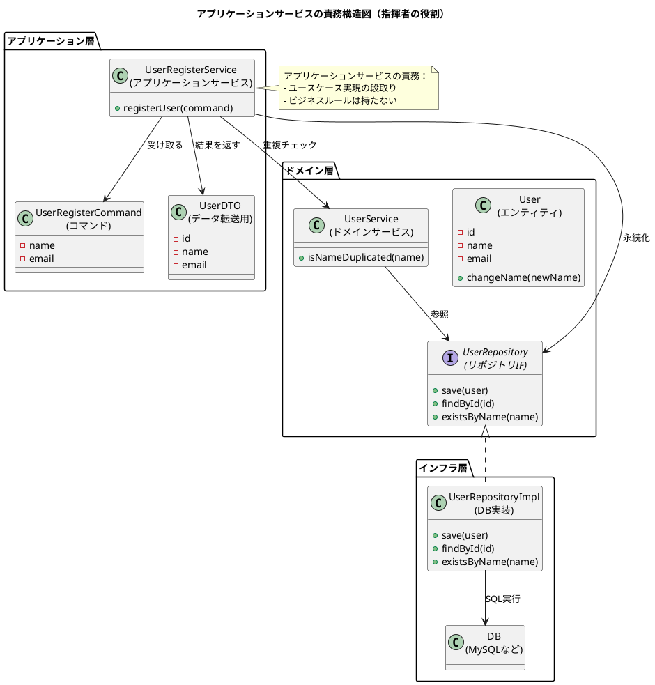

了解です！  
あなたが貼り付けてくれた **アプリケーションサービス（Application Service）についての NotebookLM 文字起こし全文** を、いつもの **6セクション構成＋PlantUML図** を使った「読書ノート形式」に変換します。

---

# ① この音声の一言まとめ

この章は、アプリケーションサービスとは「ユースケースを実現するための指揮者」であり、ドメインの専門家（エンティティ・値オブジェクト・ドメインサービス）を適切に組み合わせる“段取り係”の役割である、と説明している。同時に、ドメインルールをアプリケーションサービスに書いてしまうという致命的なアンチパターンと、それを避ける設計哲学を深く掘り下げている。

---

# ② キーアイデア（3〜5個）

### **1. アプリケーションサービスは“指揮者”であり、主役ではない**

アプリケーションサービスはユースケースを実現するために、エンティティ／値オブジェクト／ドメインサービスを順番に呼び出す薄いスクリプト。ビジネスルールは一切持たせてはいけない。

### **2. ドメインサービスとの決定的な違いは“扱う関心事”**

ドメインサービス＝ビジネスルールそのもの。  
アプリケーションサービス＝アプリケーション固有の段取り（ユースケース）。  
名前が似ていても責務はまったく異なる。

### **3. DTOで「UIにドメインを漏らさない」ことが安全性を保証する**

エンティティをUIへそのまま渡すと、ドメインロジックがアプリ全体に漏れ出し密結合を招く。DTOによる“無害化”は安全な層分離の重要なパターン。

### **4. 更新処理は“コマンドオブジェクト”で綺麗に保つ**

更新項目が増えるたびに引数が増えていく問題を回避するため、更新用のコマンド（UpdateUserCommandなど）にまとめる。将来の仕様変更への耐性が高い。

### **5. ユースケースごとにアプリケーションサービスを分割すると高凝集になる**

巨大な UserApplicationService にすべて詰めるのではなく、UserRegisterService / UserDeleteService などに分解して1クラス1責務を徹底することで、コードの明瞭性が格段に上がる。

---

# ③ NotebookLMならではの“いい比喩・表現”

- **「アプリケーションサービスは指揮者、ドメインオブジェクトは楽団員」**  
    → エンティティは演奏者。サービスは段取りとタイミングを整える役割。
    
- **「DTOは舞台裏を見せずに渡す綺麗なパンフレット」**  
    → UI層に“安全な情報だけ”渡すイメージ。
    
- **「短期的には楽、長期的には高額の請求書が届く」**  
    → ドメインルールをアプリケーションサービスに書く危険性。
    
- **「修正漏れというバグの利子が膨らむ」**  
    → ドメイン知識が分散している設計の本質的な問題点。
    

---

# ④ 印象的なQ&A（2〜5組）

**Q: ドメインサービスとアプリケーションサービスの違いは？**  
A: ドメインサービスは“ビジネスルール”を表現し、アプリケーションサービスは“ユースケースの段取り”を組み立てる。扱うレイヤが違う。

---

**Q: DTOはなぜ必要なのか？**  
A: エンティティにはルールを変えるメソッドが含まれているため、外部に渡すと制御不能になる。DTOで安全にデータだけを渡す。

---

**Q: 更新処理で引数が増えていく問題への解決策は？**  
A: 更新データをまとめた“コマンドオブジェクト”を渡し、メソッドシグネチャを変えずに済むようにする。

---

**Q: アプリケーションサービスにルールを書いてはいけない理由は？**  
A: ルール変更のたびに複数のサービスを修正する必要が生じ、修正漏れという致命的なバグを生むから。

---

# ⑤ 自分が実際にやってみること（最大3つ）

- **自分のコードのアプリケーションサービスがドメインロジックを書いていないか点検してみる**
    
- **DTOを使わずエンティティをUIへ返してしまっている箇所を発見し、改善してみる**
    
- **ユースケース単位でアプリケーションサービスを小さく分割し、“1クラス1責務”を実践してみる**
    

---

# ⑥ PlantUML図（アプリケーションサービス中心の構造図）

以下の図は、  
**アプリケーションサービス → ドメインサービス → リポジトリ → インフラ**  
という責務の流れを明確に示すものです。

---

必要なら、この図を

- 「ユースケース分割（Register/Delete/Update）」
    
- 「DTOの変換フロー」
    
- 「依存性逆転（抽象をUIが参照）」
    

などさらに細かく発展させることもできます。

---

続けて「まとめ図だけ別で出したい」「JSONで出したい」などありますか？