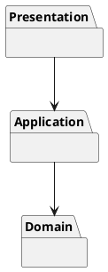
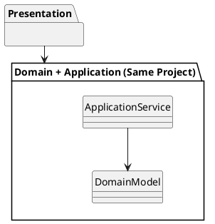

了解しました！  
では、いま貼っていただいた **「DDD：ソリューション構成」** の文字起こしを、  
あなた専用の **NotebookLM向け・読書ノート（5セクション構成＋PlantUML 図解付き）** に変換します。

---

# 📘 **DDD：ソリューション構成（Solution Structure）読書ノート**

---

## ① **この音声の一言まとめ**

**この章は一言でいうと：  
「ソリューション構成（フォルダ構成）は“コードを置く箱”ではなく、  
プロジェクトの思想・価値観を未来へ伝える“無言の設計ドキュメント”である。」**

何をどこに置くかの判断は、

- ドメインの複雑さ
    
- チームの成熟度
    
- 言語の持つアクセス制御  
    によって変わる「重い選択」であり、最初の構成がその後の数年間を左右する。
    

---

## ② **キーアイデア（4〜5個）**

### **1. ソリューション構成はプロジェクトの価値観を伝える“無言のドキュメント”**

単なる整理整頓ではなく、「このシステムは何を大切にしているか」を後続の開発者へ語りかける構造物。

---

### **2. パッケージングは“属性”ではなく“意味のまとまり（高内聚）”で分ける**

リポジトリ・ファクトリーを「種類別」にまとめるのは誤り。  
包丁とカッターの比喩の通り、「用途が同じもの」を近くに配置すべき。

---

### **3. ソリューション構成は「再利用性 vs 安全性」の大きなトレードオフ**

- **構成案1：完全分離（Domain / Application / Presentation）**  
    → 再利用性が高いが、すべて public にしなければならず安全性が低い
    
- **構成案2：Domain と Application を同一プロジェクトへ**  
    → internal を活かし安全性が高いが、再利用性は犠牲になる
    

---

### **4. 言語特性が構成の最適解を左右する（銀の弾丸はない）**

C# の `internal`、Java の package-private、Scala の限定子など、  
**言語がもつ「鍵」の種類によって設計が変わる。**

---

### **5. 正しい構成とは“理由を言語化できる構成”**

「なぜこの構成にしたのか？」を説明できることが最重要要素。  
その理由こそが設計であり、思想であり、後続の開発者へのメッセージ。

---

## ③ **NotebookLMならではの“いい比喩・表現”**

- **「ソリューション構成は無言のドキュメント」**  
    → フォルダ構造そのものが、プロジェクトの設計思想を語る。
    
- **「包丁とカッターを同じ棚にしまわない」**  
    → 種類ではなく用途（高内聚）に基づき、関連する要素をまとめるべき。
    
- **「C#のinternalは家全体の大きな鍵、Javaのpackage-privateは部屋ごとの鍵」**  
    → アクセス制御の違いが、設計の自由度を左右する。
    
- **「構成そのものが新しいメンバーへのメッセージ」**  
    → ソリューション構成は“未来の仲間へ向けた手紙”。
    

---

## ④ **印象的なQ&A（要約）**

---

### **Q: なぜリポジトリやファクトリーを種類別にまとめてはいけないのか？**

A: それらはエンティティのライフサイクルに深く関わるため。同じ用途（意味のまとまり）ごとに配置したほうが変更に強くなる。

---

### **Q: 完全分離型の構成はなぜ危険なのか？**

A: public にせざるをえず、Presentation から直接ドメインが呼ばれる危険があるため。結果としてロジックが漏れ、スパゲッティ化を招く。

---

### **Q: Domain と Application を同じプロジェクトにすると何が得られる？**

A: C# の internal により「呼んでよい場所」だけにアクセスを限定でき、規律ではなくコンパイラが安全性を保証してくれる。

---

### **Q: 最適なソリューション構成は存在するのか？**

A: ない。言語特性・プロジェクトの規模・求める価値によって変わるため。「なぜこれを選ぶのか」を説明できることが最も重要。

---

## ⑤ **私が実際にやってみること（最大3つ）**

- **自分のプロジェクトのフォルダ構成が“何を重視しているか”を説明できるようにする。**
    
- **高内聚を意識し、用途単位でクラスを整理してみる（包丁とカッターの比喩を基準に）。**
    
- **使っている言語のアクセス制御（C#, Java, TypeScript等）を調べて、構成と安全性のバランスを再評価する。**
    

---

# 🧩 **PlantUML 図解：ソリューション構成の2つの方針**

---

## ■ **構成案1：完全分離（再利用性重視）**

---

## ■ **構成案2：Domain & Application を統合（安全性重視）**

---

# 📘 さらに NotebookLM 用に最適化できます

以下も作成できます：

- **分割ノート（1テーマ＝1ノート）**
    
- **本章の“試験に出る要点”まとめ**
    
- **DDD 全体のマップ＋PlantUML**
    
- **あなたのプロジェクト用ソリューション構成の提案**
    

必要なら「次へ」と言ってください！