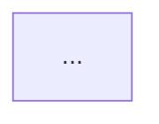

# Ticket 016: Chapter 8 - 集約

## Goal
第2部: 戦術的設計パターンの続きとして、**集約（Aggregate）**について学ぶチャプターを作成する。DDDの最も重要な戦術パターンの1つである集約の概念、設計、実装を体系的に学習できるコンテンツを整備する。

## 背景

現状:
- 既存のChapter 2（仮）に「集約とは」が1レッスンだけ存在
- 内容が簡素で、集約の深い理解には不十分

目標:
- 集約を3レッスンに拡充し、Chapter 8として適切に配置
- 整合性の境界、集約ルート、設計ガイドラインを体系的に学習
- Chapter 5（値オブジェクト）、Chapter 6（エンティティ）の知識を前提とした内容

## Scope

### In Scope
- Chapter 8の3レッスン作成（lesson-8-1, lesson-8-2, lesson-8-3）
- 各レッスンのクイズ作成（5問/レッスン）
- sampleLessons.ts, sampleQuizzes.ts, sampleCourses.ts の更新
- Mermaid図解を活用した視覚的な説明

### Out of Scope
- 既存のChapter 1-7の修正
- アーキテクチャレイヤーとの統合（Chapter 12-15で扱う）
- リポジトリパターン（Chapter 9で扱う）

## レッスン構成

### Lesson 8-1: 集約とは

**学習目標:**
- 集約の定義と目的を理解する
- 整合性の境界の概念を理解する
- 不変条件（Invariant）の重要性を理解する

**主要トピック:**
- 集約の定義
- なぜ集約が必要か（整合性の問題）
- トランザクション境界としての集約
- 不変条件の保護
- 集約の例（注文と注文明細、ブログ記事とコメント）

**図解:**
- 集約の境界を示す図（Mermaid）
- 整合性が壊れる例と集約による保護
- トランザクション境界の可視化

### Lesson 8-2: 集約ルート

**学習目標:**
- 集約ルートの役割を理解する
- 外部からのアクセス制御を理解する
- 集約内部の整合性を保つ実装パターンを習得する

**主要トピック:**
- 集約ルートの定義
- 外部アクセスの制限（集約ルート経由のみ）
- 集約内部エンティティへの直接アクセス禁止
- 集約ルートが提供すべきメソッド
- TypeScriptでの実装例

**図解:**
- 集約ルートとその配下のエンティティ・値オブジェクト（Mermaid classDiagram）
- 正しいアクセスパターンと誤ったアクセスパターン
- 集約ルートのメソッド設計

### Lesson 8-3: 集約の設計ガイドライン

**学習目標:**
- 適切な集約サイズの決め方を理解する
- 集約の境界を見つける方法を習得する
- よくある設計ミスとその回避方法を学ぶ

**主要トピック:**
- 小さな集約を優先する原則
- トランザクションの一貫性 vs 結果整合性
- 集約間の参照（IDによる参照）
- 大きすぎる集約の問題
- 集約の分割と統合の判断基準
- イベント駆動による集約間連携

**図解:**
- 集約サイズの比較（小 vs 大）（Mermaid）
- 集約間の参照パターン
- イベントによる集約間連携

## Task Assignment

| Worker | Worktree | 担当領域 | 依存関係 |
|--------|----------|----------|----------|
| Frontend1 | 016-frontend1 | Lesson 8-1, 8-2, 8-3 作成、クイズ作成 | なし |
| Quality | 016-quality | 全レッスン動作確認、テスト | Frontend1完了後 |

## Execution Order

```
Phase A: コンテンツ作成
└── Frontend1: 3レッスン + クイズ作成

Phase B: 検証
└── Quality: 動作確認・テスト実行
```

## Technical Requirements

| 項目 | 指定技術 |
|------|----------|
| コンテンツ形式 | Markdown |
| 図解 | Mermaid（graph, classDiagram, sequenceDiagram, mindmap等） |
| コード例 | TypeScript |
| スタイリング | Tailwind CSS（MarkdownRendererが自動適用） |
| テスト | Vitest |

## クイズ要件

各レッスンに5問の選択式クイズを作成:

| 項目 | 仕様 |
|------|------|
| 問題数 | 5問/レッスン（合計15問） |
| 形式 | 4択選択式 |
| 解説 | 正答・誤答の理由を明確に記載 |
| 難易度 | 基本3問、応用2問 |

## Definition of Done

- [ ] Lesson 8-1, 8-2, 8-3のMarkdownコンテンツ作成完了
- [ ] 各レッスンに5問のクイズ作成完了
- [ ] sampleLessons.ts に3レッスン追加完了
- [ ] sampleQuizzes.ts に15問追加完了
- [ ] sampleCourses.ts のChapter 8構造更新完了
- [ ] 全レッスンがブラウザで表示可能
- [ ] 全クイズが動作する
- [ ] Mermaid図解が正しく表示される
- [ ] 全テストがパス（npm run test）
- [ ] 型チェックがパス（npm run type-check）

## コンテンツガイドライン

### Markdown構造

```markdown
# レッスンタイトル

## 概要
このレッスンで学ぶこと...

## [メインセクション1]

### [サブセクション]

**図解（Mermaid）:**


**コード例:**
```typescript
// 実装例
```

## まとめ

- 重要ポイント1
- 重要ポイント2
- 重要ポイント3
```

### 実装例の品質基準

- TypeScriptの型を適切に使用
- DDDパターンに準拠したコード
- コメントで重要な意図を説明
- 実践的で理解しやすい例

### Mermaid活用

- classDiagram: クラス構造、集約の構成
- graph TD/LR: 概念図、フロー図、境界の可視化
- sequenceDiagram: 操作の流れ
- mindmap: 概念の整理

## Reference

- CONTENT_ROADMAP.md: チャプター構成
- Chapter 5（値オブジェクト）: 不変性の概念
- Chapter 6（エンティティ）: 同一性とライフサイクル
- Chapter 7（ドメインサービス）: ドメインロジックの配置
- Ticket 011-013の実装パターン

## Notes

- 集約は初学者にとって難しい概念なので、具体例を豊富に用意すること
- 「小さな集約」の原則を強調すること
- トランザクション整合性と結果整合性の違いを明確にすること
- 実務でよくある「大きすぎる集約」の問題を具体的に示すこと
