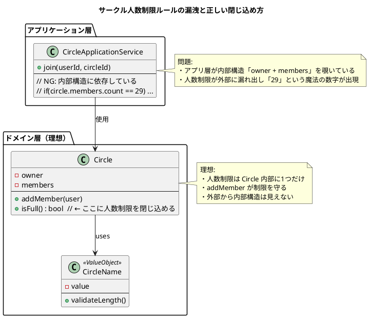

了解しました！  
いただいた文字起こしテキストを、あなたが指定した **5つのセクション形式の「読書ノート」** に変換します。  
（PlantUML 図解も含めて出力します）

---

# 📘 読書ノート（章：謎の「29」問題とドメインルールの漏れ）

---

## ① **この音声の一言まとめ**

この章は、**ビジネスルールがコードのあちこちに漏れ出すと、たった1つの数字（29）が未来の重大バグになる**ことを示し、DDD が目指す「ルールを適切な場所に閉じ込める設計」の重要性を解説している。

---

## ② **キーアイデア（4つ）**

### **1. ビジネスルールはコードの外へ漏れ出してはいけない**

ビジネス上の重要な数値や条件がコード中に散逸すると、修正漏れ・バグの温床になる。ルールは“しかるべき場所”に封じ込める必要がある。

### **2. 値オブジェクトで「ルールを内側に組み込む」**

サークル名のように、単独で完結するルール（3〜20文字制限）は、値オブジェクトに埋め込むことで常に正しい状態を保証できる。

### **3. 数字「29」の正体は「内部構造の漏洩」**

上限30名というルールを守るために、アプリケーション層のコードが「オーナー1名 + メンバー29名」という内部構造を勝手に参照してしまっている。  
→ ドメインルールが外に漏れる典型例。

### **4. 集約（アグリゲート）が“ルールの金庫”になる**

本来人数制限は **サークル集約の中に1つだけ存在するべきルール**。  
外部から内部構造を覗かせず、一箇所で整合性を守る。

---

## ③ **NotebookLM ならではの“いい比喩・表現”**

- **「謎の29は時限爆弾」**  
    → 一見小さな違和感が、将来大きなバグとして爆発する。
    
- **「城の防御設計図が外部に漏れている」**  
    → 内部構造（オーナー1名 + メンバー）が外から丸見えの危険性。
    
- **「値オブジェクトは入口で不正データを止める門番」**  
    → データが不正な状態のまま存在できなくなる。
    
- **「集約はルールの金庫」**  
    → ルールはその中に1つだけ保管し、どこにも漏れない。
    

---

## ④ **印象的な Q&A（4組）**

**Q: なぜ仕様は30人なのにコードは29でチェックしているのか？**  
A: サークル内部が「オーナー1 + メンバーリスト」という構造で、外側が内部構造に依存して計算してしまっているため。

---

**Q: この29が何を意味しているか、どうして問題なのか？**  
A: ルールが本来あるべきサークルオブジェクト内部ではなく、複数箇所に漏れてしまっていることの証拠。修正時に必ずバグになる。

---

**Q: 上限数の変更（30→50人）でどんな悲劇が起こる？**  
A: 29や30という“魔法の数字”をあちこち探し回る羽目になり、どこか1箇所でも漏れるとバグへ直行する。

---

**Q: どうすれば人数制限のロジックを1箇所に閉じ込められる？**  
A: DDD の最重要概念「集約（アグリゲート）」を使い、人数制限ルールをサークル集約内部に1つだけ置く。

---

## ⑤ **自分が実際にやってみること（最大3つ）**

- **“ルールが散らばっていないか” をコードレビューで確認してみる。**
    
- **単独で成り立つルールは値オブジェクト化して、外部依存を断ち切る。**
    
- **集約（アグリゲート）の境界を明確にし、人数制限や整合性ルールを内部に集中させる。**
    

---

# 📝 PlantUML 図解

### 「内部構造の漏洩 → 外部に29が漏れ出す問題」を示す図

---

必要なら、  
**「集約とは何か？」を専用の図解つきで1章まるごとまとめる**  
こともできます。

続きを作りましょうか？