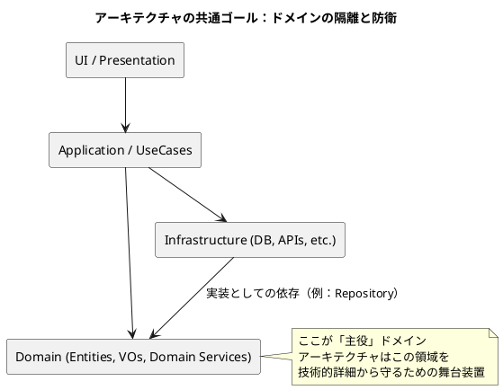

いい流れで「DDD読書会ポッドキャスト」続いてて楽しいですね。  
この回は **「アーキテクチャは主役じゃないけど、ドメインの“ボディーガード”として必須」** って話だったので、前回までと同じく **NotebookLM向けの読書ノート＋図付きメモ** にまとめます。

---

# 📘 NotebookLM 読書ノート

## Deep Dive：DDDとアーキテクチャ「主役じゃないけど不可欠な相棒」編

---

## 🧩 一言まとめ（TL;DR）

> DDDでアーキテクチャが重視されるのは、  
> **ビジネスロジック（ドメイン）を UI や DB から隔離・防衛して、  
> 「変更する自由」を長期的に守るため** であって、  
> アーキテクチャそのものが主役だからではない。

---

## 1. そもそも：なぜ DDD を学ぶとすぐアーキテクチャの話になるのか？

- DDD は本来、  
    「**ビジネスの本質（ドメイン）をどうモデル化するか**」という泥臭い世界の話。
    
- なのに本や記事を読むと、  
    いきなりレイヤードアーキテクチャだの、ヘキサゴナルだの、クリーンだの…アーキ話だらけ。
    
- その理由：
    
    - **アーキテクチャは主役じゃないけど、主役（ドメイン）を守る舞台装置** だから。
        
    - いい舞台がないと、どんな名優（ドメインモデル）も真価を発揮できない。
        

---

## 2. 「利口なUI」という静かな地雷

### ✅ 利口なUIとは？

- ECサイトを例に：
    
    - 注文確認画面
        
    - 注文履歴画面
        
    - 管理画面…  
        それぞれで **合計金額を UI 側で計算してしまう** 実装。
        

```pseudo
// どの画面にも似たようなロジックが…
total = items.Sum(i => i.unitPrice * i.quantity) + shippingFee - discount
```

### これがなぜ危険か？

1. **変更に弱い**
    
    - 税率変更・送料条件変更・ポイントルール変更 などが来ると…
        
    - 「3つ全部の画面で同じ修正をしなきゃいけない」
        
    - 1箇所でも漏れると仕様不一致のバグ。
        
2. **ロジックの“足”が生える**
    
    - 画面ごとに「こっちは手数料を先に引く」「こっちはポイント後引き」みたいにカスタムされ始める。
        
    - もとは同じロジックだったものが、時間とともに分岐して「誰にも全体像がわからないモンスター化」。
        

> 利口なUI = 短期的には楽  
> でも **未来の選択肢（変更の自由）を売り払っている** 行為。

---

## 3. アーキテクチャの役割：未来の選択肢を守る「保険」

- 人の善意や自制心に頼ると  
    「今回だけ」「あとで綺麗にするから」が積もり積もって地獄行き。
    
- だからこそ **仕組みとして** こう決める：
    

> 「ビジネスロジックは **ここ（ドメイン層）に書きなさい**」  
> 「UIやDBはあくまで“入出力の器”に留めなさい」

- アーキテクチャはその **“ルールを支える地図・レール”** みたいなもの。
    

---

## 4. 共通するゴール：「ドメインの隔離と防衛」

資料で出てきた代表的アーキテクチャは3つ：

1. レイヤードアーキテクチャ
    
2. ヘキサゴナルアーキテクチャ（ポート＆アダプター）
    
3. クリーンアーキテクチャ
    

全部アプローチは違うけど、  
**目指すゴールは同じ**：

> UI や DB などの技術的詳細から  
> **ドメインモデルを隔離・防衛して、  
> 変更に耐えられる構造にすること。**

---

## 5. レイヤードアーキテクチャ（4層）

### レイヤー構成

1. **Presentation 層**
    
    - コントローラー、ビューなど
        
    - HTTPや画面イベントといった「入り口」の処理を担当
        
2. **Application 層**
    
    - ユースケース単位の「指揮者」
        
    - ドメインオブジェクトを組み合わせて、  
        「ユーザー登録する」「注文を確定する」といったタスクの流れを管理
        
3. **Domain 層**
    
    - エンティティ、値オブジェクト、ドメインサービス
        
    - ビジネスルールの中心
        
4. **Infrastructure 層**
    
    - DB、外部API、メッセージングなど
        
    - 技術的な詳細
        

### 依存ルール

- 原則：**上 → 下 にだけ依存可能**
    
    - Presentation → Application → Domain → Infrastructure
        
- **Domain が UI を知ることは絶対ない**  
    → ドメインはフレームワークやDBから独立。
    

---

## 6. ヘキサゴナルアーキテクチャ（ポート＆アダプター）

### イメージ：ゲーム機とコントローラー・テレビ

- **ゲーム機本体**：アプリケーションのコア（ドメイン＋アプリケーション層）
    
- **ポート**：ゲーム機の端子（インターフェース）
    
- **アダプター**：各社コントローラー・テレビ（Web、CLI、DBなど）
    

> 本体は「どういう端子（ポート）を公開するか」だけ決める。  
> どのメーカーのコントローラーがつながるかには関心を持たない。

### 効能

- Web UI → CLI への変更
    
- MySQL → PostgreSQL への変更
    
- などがあっても、「ポートを満たすアダプターを差し替えればいいだけ」で、コアは手を触れない。
    

---

## 7. クリーンアーキテクチャ

### 同心円構造

- 中心：**ビジネスルール（エンティティ・ユースケース）**
    
- 外側：UI、DB、フレームワーク
    
- ルール：
    
    - **依存は外側 → 内側のみ許可**
        

### 特徴

- 役割に名前がつく
    
    - ユースケースを包む **インタラクター**
        
    - 境界のやり取りを担う **ポート**
        
    - 表示形式を整える **プレゼンター**
        
- 「**あらゆるものがテスト可能であるべき**」という強いスタンス。
    

---

## 8. 3つのアーキテクチャの共通構造（ざっくり図）



レイヤード / ヘキサゴナル / クリーンは、  
この図をそれぞれ「縦に見るか」「内外で見るか」「同心円で見るか」の違いに近い。

---

## 9. アーキテクチャがもたらす認知負荷の軽減

> 一度に多くのことを考えなくて済むようにする  
> ＝ 人間の「マルチタスク苦手問題」を設計でケアする

- UI 実装中：  
    「ボタンの色をどうするか」「バリデーションメッセージの見せ方」などに集中  
    → 合計金額の計算ロジックは **ドメイン側に追い出しているので、今は忘れていい**
    
- ドメインロジック実装中：  
    「割引ルール」「税率」「ポイント付与条件」に集中  
    → HTTP リクエストとか SQL の書きっぷりは **インフラ側の責任** なので今は考えなくていい
    

結果として：

- 思考が迷子になりにくい
    
- ドメインの探求に脳のメモリを多く割ける
    

---

## 10. 今日のコアメッセージの整理

1. **アーキテクチャは主役じゃない**
    
    - 主役はあくまで「ドメインモデル」「ビジネスルール」
        
2. でも **アーキテクチャなしでは主役は守れない**
    
    - 利口なUIのようなショートカットは  
        短期的には楽だが「変更する自由」を奪う技術的負債。
        
3. レイヤード / ヘキサゴナル / クリーンは言い方が違うだけで
    
    - どれも **「ドメインを隔離・防衛する」という頂上** を目指している。
        

---

## ❓ NotebookLM向け・思考を深める問い

> プロジェクトの本当に初期、  
> まだ「何を作るか」自体が揺れている段階で、  
> **厳格なアーキテクチャを早期に導入することは、  
> ドメイン探索を助けるのか？それとも妨げるのか？**
> 
> - どのタイミングから「アーキに投資するコスト」が  
>     「変更の自由」というリターンを上回り始めるのか？
>     
> - あなたのプロジェクトの文脈で、その境界線をどこに引きますか？
>     

---

もしよければ：

- この回も前回と同じように **「第○章：アーキテクチャは主役じゃない」** として  
    章立てを揃えた NotebookLM 用「DDD読書ノート集」を統合していくこともできます。
    

次は「プロトタイピングフェーズとアーキテクチャ投資のバランス」みたいな回に進めても面白そうですね。