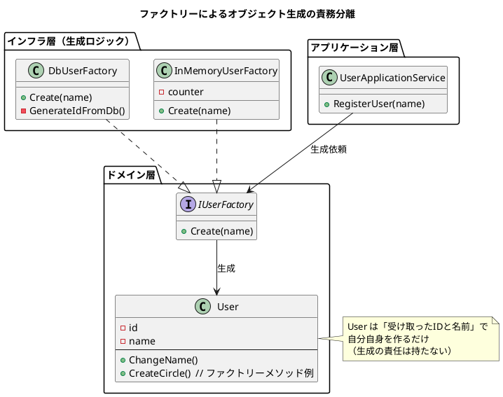

了解です！  
**これは NotebookLM 文字起こしデータ（ファクトリー章）なので、前回あなたが指定した “読書ノート作成プロンプト＋PlantUML 図解つき” の形式で出力します。**

---

# 📘 **ドメイン駆動設計：ファクトリー章 読書ノート**

---

## ① この音声の一言まとめ

**ファクトリーとは、「オブジェクトの生成」という複雑で汚れやすい仕事を、ドメインモデル本体から切り離すための設計パターンである。**  
責務を整理し、テストしやすく変更に強いモデルを作るための“生成専門家”として、極めて重要な役割を果たす。

---

## ② キーアイデア（3〜5個）

### **1. 生成と利用はまったく別の責務**

オブジェクトの“使い方”と“作り方”は根本的に別物。  
生成処理をコンストラクタに詰め込むと、関心が混ざり脆くテストしにくい設計になる。

### **2. ファクトリーは「汚れやすい生成処理」を引き取る工場**

IDの採番、DBアクセス、複雑な初期化など、生成時だけ必要なロジックをファクトリーに隔離する。  
ドメインモデルの責務が純粋になり、変更耐性が大幅に増す。

### **3. インターフェース化で実装差し替えが自由になる**

`IUserFactory` のような抽象レイヤーを入れて、  
本番用・テスト用のファクトリーを自由に入れ替えられる。  
→ テストが高速・独立になる。

### **4. コンストラクターは「受け取るだけ」に徹するべき**

コンストラクターの中で別オブジェクトを“取りに行く”のは危険信号。  
その瞬間、生成担当者が“誰なのか“が曖昧になり、責務が崩れ始める。

### **5. ファクトリーメソッドで「内部情報を守ったまま生成」できる**

ユーザーの内部IDを外に漏らしたくないとき、  
`User.CreateCircle()` のようなメソッドで関連オブジェクトを生成できる。  
カプセル化を保ちながら安全に生成できる非常に強力なパターン。

---

## ③ NotebookLMならではの“いい比喩・表現”

- **「道具を使うことと道具を作ることは別の知識」**  
    → 生成と利用の責務の違いを説明するたとえ。
    
- **「コンストラクターにDB接続を書いた瞬間に悲劇が始まる」**  
    → 責務混在による破滅を象徴的に説明。
    
- **「内部のIDを守りたいとき、ユーザー自身が小さな工場になる」**  
    → ファクトリーメソッドの本質を端的に表す。
    
- **「若い頃、テストが3分待ちになってコーヒーを淹れに行った」**  
    → テスト不能なモデルの痛みを象徴するエピソード。
    
- **「ファクトリーは主役を支える助演俳優」**  
    → ドメインモデルを主役としたときの構造理解が深まる。
    

---

## ④ 印象的なQ&A（2〜5組）

---

### **Q: なぜユーザークラスの中で ID 採番や DB 接続ロジックを書くのが危険なのか？**

**A:** ビジネス上の概念（ユーザー）と技術的詳細（DBアクセス）が混ざり、変更に弱くテスト不能な脆い設計になるため。

---

### **Q: ファクトリーを使うと何が嬉しいのか？**

**A:** 生成処理をドメインモデルから分離でき、テスト用・本番用の生成処理を自由に差し替えられる。

---

### **Q: 新しく参加した開発者は、ファクトリーを使うべきことにどう気づける？**

**A:** ユーザークラスと工場インターフェースを同じパッケージに置くことで、自然に関連性を理解できる。

---

### **Q: DB内の自動採番を使えば簡単なのでは？**

**A:** IDが生成前に空になるため不安定で、IDの setter 公開が必要になり、ドメインモデルが弱くなる。

---

### **Q: リポジトリにID採番を持たせるのはどう？**

**A:** 手軽だが、永続化の責務に加えて採番という別の関心事が入り、設計の純度が落ちるというトレードオフがある。

---

## ⑤ 自分が実際にやってみること（最大3つ）

- **生成処理が複雑化しているクラスを見つけて、工場クラスに切り出してみる。**
    
- **コンストラクタの中で“他のオブジェクトを取りに行っていないか”を点検してみる。**
    
- **本番用・テスト用のファクトリーを作り、DIコンテナで切り替えられるようにしてみる。**
    

---

# 🏭 PlantUML 図解：ファクトリーによる責務分離

---

必要であれば：

- **既存オブジェクトの再構築（Reconstitution）専用の仕組みの図解**
    
- **ファクトリー vs リポジトリ vs アプリケーションサービスの違い図解**
    
- **あなたのプロジェクトコードを使った実践的なファクトリー設計**
    

なども追加できます。

---

次に進めますか？  
**「再構築（Reconstitution）のとき、ファクトリーをどう応用するか」も続けてまとめましょうか？**