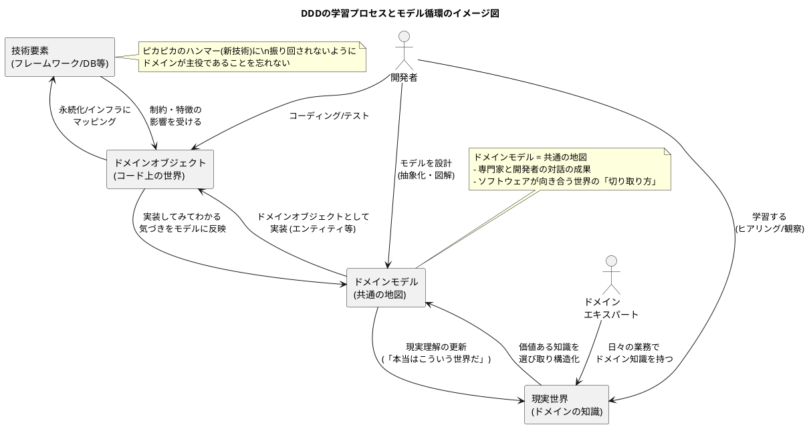

![[DDD_2.png]]

![[Domain-Driven_Design_An_Invitation_2.pdf]]

① この音声の一言まとめ  
この章は、「ドメイン駆動設計（DDD）」を支える原点的な考え方――  
「開発者は利用者の世界に無知である」という前提から出発し、  
ドメイン（問題領域）の知識をどう選び取り、ドメインモデルとして構造化し、  
コード（ドメインオブジェクト）と相互に育てていく哲学と実践を、  
片道ロケット vs 飛行機運用という比喩を交えて説明した内容です。

---

② キーアイデア（3〜5個）

- **「開発者は利用者の世界に無知」であるという誠実な前提**  
    開発者は会計や物流など、対象業務の専門家ではない。  
    これは非難ではなく、「無知であることを認める誠実さ」であり、  
    だからこそ開発とは「学習のプロセス」だというのがDDDの出発点。
    
- **ドメインとは“価値ある知識だけを選び抜いた世界”**  
    物流なら「積載量」「燃費」は配送計画に直結する価値ある知識だが、  
    「トラックの語源」などは価値がない。  
    ドメインエキスパートと開発者が対話しながら、  
    “ビジネス価値に直結する知識”だけを選び取った集合体がドメインになる。
    
- **ドメインモデルは「現実の切り取り方を共有する地図」**  
    同じペンでも、小説家にとっては「書き心地」、文房具店にとっては「価格・在庫」が重要。  
    どの側面を切り取るかはドメインによって変わる。  
    その「どの現実をどう抽象化するか」を、みんなで共有できる形にしたものがドメインモデル。
    
- **ドメインオブジェクトは“地図を走る乗り物”であり、モデルとコードは相互に進化する**  
    ドメインモデルは地図、ドメインオブジェクトはその地図上を走る乗り物。  
    現実が変わればまず地図（モデル）を更新し、次に乗り物（コード）を修正する。  
    同時に、実装してみた結果の「道がつながらない」気づきから、  
    逆にモデル側を見直すこともあり、両者は反復的に進化していく。
    
- **DDDは“片道ロケット開発”から“飛行機の安定運用”への転換を支える哲学**  
    昔の「とにかく早く打ち上げる」片道ロケット型開発は、  
    変更や機能追加という“帰りの燃料”をほぼ積んでいない。  
    今は、何度も離発着しながら変化に追従し続ける「飛行機運用」が求められる。  
    DDDは、長期運用・頻繁な変更に耐えるために、ドメインを中心に据える哲学と道具箱として再注目されている。
    

---

③ NotebookLMならではの“いい比喩・表現”

- **「ソフトウェア開発者は利用者を取り巻く世界について基本的に無知である」**  
    → 開発の出発点は“知らない”を認めること、というDDDの原点を突いたフレーズ。
    
- **「ピカピカのハンマーは見るものすべてを釘に変えてしまう」**  
    → 新技術に夢中になるあまり、本来解決すべきユーザーの問題を見失う危険を表す比喩。
    
- **「ドメインモデルは共通の地図」**  
    → 専門家と開発者が共有する現実世界の“切り取り方”を図としてイメージしやすくする表現。
    
- **「ドメインオブジェクトはその地図を走る乗り物や道具」**  
    → モデル（地図）とコード（乗り物）の関係を直感的に示すメタファー。
    
- **「昔ながらの開発は片道ロケット、今求められるのは飛行機の安定運用」**  
    → 初速だけ重視した一発打ち上げ型と、長期運用・変更耐性重視のスタイルの違いをわかりやすく描いた比喩。
    

---

④ 印象的なQ&A（2〜5組）

**Q: なぜ「開発者は利用者を取り巻く世界について無知」という前提から始めるのか？**  
A: 開発者は会計・物流などの専門家ではなく、その業務の細部を知らないのが普通だから。  
　それを誠実に認めることで、「開発＝学習プロセス」という姿勢になり、  
　ドメインエキスパートから学び、その知識をソフトウェアに反映する土台ができる。

---

**Q: どこまでドメイン知識を学べばよいのか？全部理解すべき？**  
A: すべてではなく、「ビジネス価値に直結するか」で取捨選択する。  
　物流であれば、積載量や燃費など配送計画に必須の情報は重要だが、  
　語源のような雑学はシステムの目的に寄与しないので切り捨てる。  
　その境界線をドメインエキスパートと対話しながら引いていく。

---

**Q: ドメインモデルとドメインオブジェクトの違いは？**  
A: ドメインモデルは、ドメイン知識を構造化した「地図」。  
　ドメインオブジェクトは、その地図をもとにコードとして具現化された「乗り物や道具」。  
　現実の変化 → モデル更新 → オブジェクト更新、という流れもあれば、  
　実装してみての気づきからモデルを見直す“逆流”もある。

---

**Q: DDDはなぜ実践が難しいと言われるのか？**  
A: 概念や専門用語が多いため学習コストが高いことに加え、  
　開発者だけで完結せず、忙しいドメイン専門家との継続的な対話が必須だから。  
　組織文化や協力体制も影響するため、個人の努力だけでは限界がある。

---

**Q: それでも個人としてDDDに取り組むにはどうすればいい？**  
A: すべてを一気に導入しようとせず、値オブジェクトやエンティティなど、  
　「ドメインの重要な概念をコード上で表現するパターン」から少しずつ取り入れる。  
　DDDは哲学でもあり、実践テクニックの集合でもあるので、  
　手の届く範囲から始めて徐々に広げればよい。

---

⑤ 自分が実際にやってみること（最大3つ）

- **自分のプロジェクトの“ドメイン”を書き出してみる**  
    「このシステムは何の世界を扱っているのか？」「ビジネス価値に直結する知識は何か？」を  
    3〜5個くらい箇条書きにしてみる。
    
- **ペンの例にならって“誰の視点のモデルか”を明確にする**  
    自分のシステムについて、「小説家視点」「店長視点」のように、  
    利用者の立場を1つ選び、その人にとって何が重要な属性・振る舞いかを整理してみる。
    
- **小さなドメインモデル図を1枚描いて、チームで共有してみる**  
    完璧でなくてよいので、「この世界にはこういう概念があって、こうつながっている」  
    という簡単な概念図を描き、チームメンバーと「これって本当に現場の世界っぽい？」と話してみる。
    

---

⑥ PlantUMLでの図解

この章で語られた「ドメイン知識 → ドメインモデル → ドメインオブジェクト → 実装 → フィードバック → モデル更新」の流れと、  
ドメインエキスパート・開発者・技術の関係を簡単な概念図にしました。

この図を眺めながら、  
「自分の現場だと“Real / Model / Code / Tech”は何に相当するか？」  
をノートに書き出してみると、さらに理解が深まると思います。