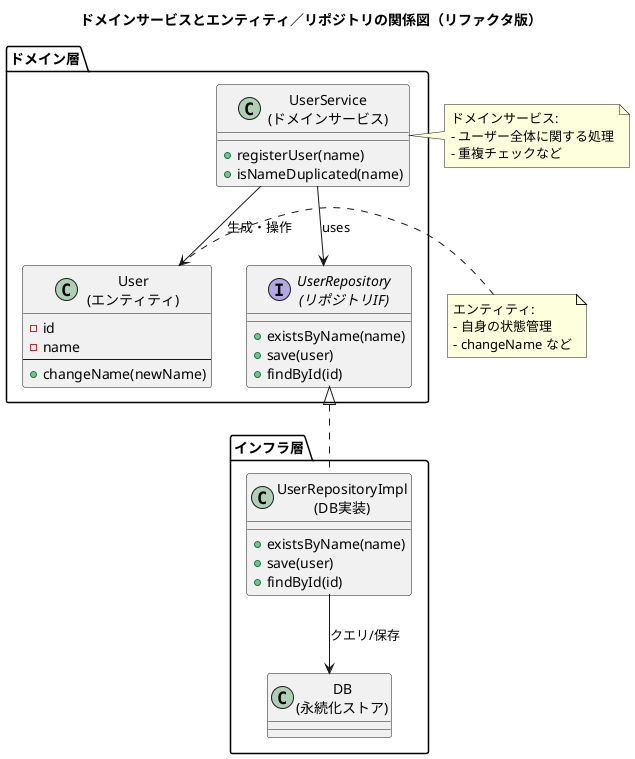

① この音声の一言まとめ  
この章は、DDDにおける「ドメインサービス」とは何かを、

- “どのオブジェクトにも属さない振る舞いの置き場所”
    
- “乱用するとドメインモデル貧血症を招く危険な薬”
    
- “複数オブジェクトにまたがるビジネスプロセスのコーディネーター”  
    という三つの視点から掘り下げ、さらにリポジトリとの役割分担と「ビジネスロジックと技術の境界線」という根源的な問いにまで踏み込んだ内容です。
    

---

② キーアイデア（3〜5個）

- **ドメインサービスは「どのエンティティにも属しにくい振る舞い」の置き場所**  
    ユーザー名重複チェックのように、「ユーザー1人」ではなく「ユーザー全体」に関わる処理は、ユーザーエンティティに書くと不自然になる。  
    そのような振る舞いを、特定のオブジェクトから切り離し「活動そのもの」として表現する場所がドメインサービス。
    
- **“何でもサービス”はドメインモデル貧血症という大事故を招く**  
    本来ユーザー自身が持つべき `changeName` のような振る舞いまでサービスに集めてしまうと、エンティティはただのデータ入れ物になり、ルールはサービスクラスに散逸する。  
    これはオブジェクト指向の「データと振る舞いの一体化」に逆行し、変更がつらく、モデルからドメイン知識が失われる。
    
- **ドメインサービスの“主役級の適用場面”は、複数オブジェクトを調整するプロセス**  
    物流の「拠点Aから拠点Bへ荷物を運ぶ」処理では、Aの出庫とBの入庫がセットで成立しなければならない。  
    どちらか一方の拠点に責任を押し込むと結合が強くなり不自然になるため、`TransportService` のようなドメインサービスが両者を調整し、必要ならロールバックや通知も担う。
    
- **ドメインサービス＋リポジトリで“ビジネスロジックと技術詳細”を切り離す**  
    ユーザー名重複チェックはDB問い合わせが必要だが、サービスにSQLを書いてしまうとビジネスロジックとインフラが混ざる。  
    そこでリポジトリという「通訳」を介し、サービスは「この名前のユーザーはいる？」とだけ尋ね、具体的なDB操作はリポジトリ側に隔離する。
    
- **DDDの本質は「純粋なドメインルール」と「それを支える技術」の境界線をどう引くか**  
    ドメインロジックがどこまで外部システム（DB制約など）を前提にしてよいのかは、設計者によって意見が分かれる。  
    境界線の引き方に唯一の正解はないが、その判断がアーキテクチャと未来の変更容易性を大きく左右する。
    

---

③ NotebookLMならではの“いい比喩・表現”

- **「ソフトウェア開発は、ビジネスの本質と技術的現実との戦い」**  
    → ビジネスルールを純粋に保ちたい理想と、DBなどの具体的技術で動かさないといけない現実との葛藤を端的に示す。
    
- **「本の1ページに向かって『この本は本棚にありますか？』と尋ねるようなもの」**  
    → 個々のユーザーオブジェクトに「システム全体に同じユーザーは存在しますか？」と問う不自然さを視覚的に説明する比喩。
    
- **「ドメインモデル貧血症：栄養失調でスカスカになったモデル」**  
    → 振る舞いが全てサービス側に追い出され、エンティティがゲッター・セッターだけになる危険な状態を“病気”として表現。
    
- **「リポジトリはドメインとインフラの通訳」**  
    → ドメインサービスは「ユーザーを保存して」とだけ言い、裏でSQLだろうとファイルだろうと翻訳する役割を分かりやすく言い換えている。
    
- **「最後の手段としてのドメインサービス」**  
    → 原則エンティティ＆値オブジェクト、どうしても不自然な時だけサービス、という設計指針を印象づける表現。
    

---

④ 印象的なQ&A（2〜5組）

**Q: そもそもドメインサービスは何のために必要なの？**  
A: 特定のエンティティに責任を押し込むと不自然になるような振る舞い、特に「集合全体に関わる処理」や「複数オブジェクトをまたぐプロセス」を扱うため。  
　ユーザー名の重複チェックや、物流の拠点間輸送のような処理が代表例。

---

**Q: なんでもかんでもサービスに入れてしまうと何が問題？**  
A: エンティティから振る舞いが抜け落ち、データだけを持つ“貧血症モデル”になる。  
　結果として、  
　- どのクラスを見てもドメインルールが分からない  
　- 変更時にサービスとエンティティ両方を行き来する必要がある  
　- モデルがドメインの知識を語らなくなる  
　といった、保守性と理解しやすさの低下を招く。

---

**Q: ドメインサービスが主役になる、理想的なケースって？**  
A: 物流の輸送のように、複数のエンティティ（拠点A・拠点B）をまたぎ、かつ一貫性が必須なビジネスプロセス。  
　`TransportService` が「Aから出庫 → Bへ入庫 → 途中失敗したらAをロールバック」といった一連の流れと例外処理を担うのが自然。

---

**Q: ドメインサービスがDBに直接アクセスするのはOK？それともNG？**  
A: ここは設計者によって意見が分かれる。  
　- 「DBのユニーク制約とセットでユニーク性が保証されるのだから、ドメインロジックがDBを知るのは当然」と見る立場  
　- 「ドメインは純粋であるべきで、インフラはリポジトリなどで完全に隠すべき」と見る立場  
　どこに境界線を引くかが、システム全体のアーキテクチャに大きく影響する。

---

⑤ 自分が実際にやってみること（最大3つ）

- **自分のコードの中の「置き場所に困っている処理」をリストアップしてみる**  
    どのエンティティにも自然に置けていない処理があれば、ドメインサービス候補としてノートに書き出してみる。
    
- **既存のサービスクラスから「本来エンティティにあるべき振る舞い」を探して戻してみる**  
    `UserService.changeName(user, newName)` のようなメソッドを見つけたら、  
    `user.changeName(newName)` に移せないか検討してみる。
    
- **リポジトリを一枚かませて“通訳”構造を試してみる**  
    直接DBクエリを書いているドメインサービスがあれば、`UserRepository` などのインターフェースを挟み、  
    サービス側からは「問い合わせ／保存」を依頼するだけにしてみる。
    

---

⑥ PlantUMLでの図解

ドメインサービス・エンティティ・リポジトリ・インフラの関係と、  
「やりすぎドメインサービス（貧血症モデル）」との対比を簡易図にしました。

この図を眺めながら、

- 自分のプロジェクトの `UserService` は「God Service化」してないか？
    
- `User`（や他のエンティティ）がちゃんと「自分のルール」を語れているか？
    

をチェックしてみると、ドメインサービスの使い方の改善ポイントが見えてくると思います。