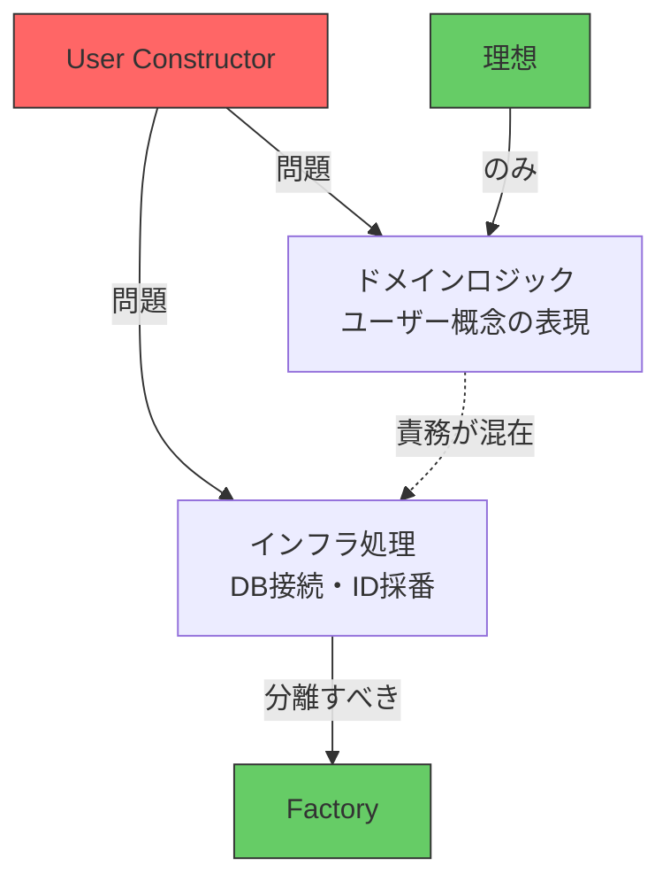
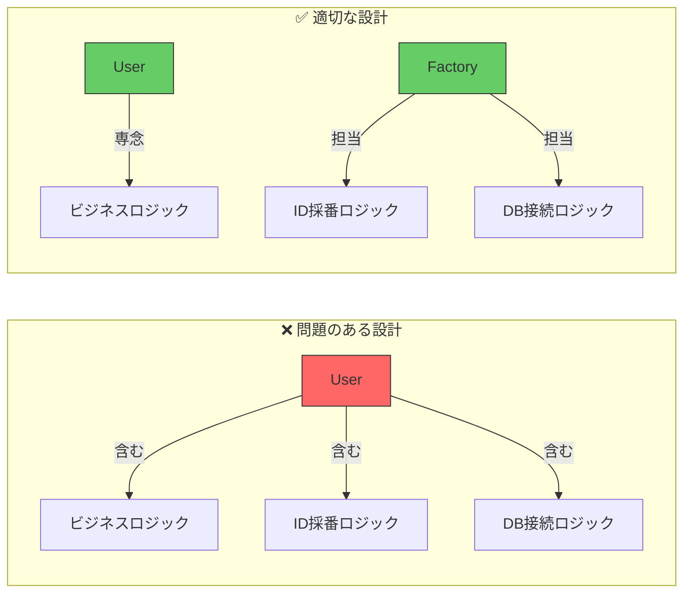
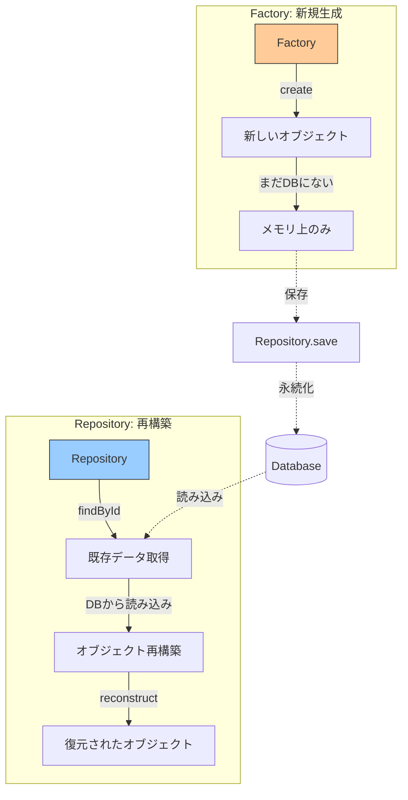
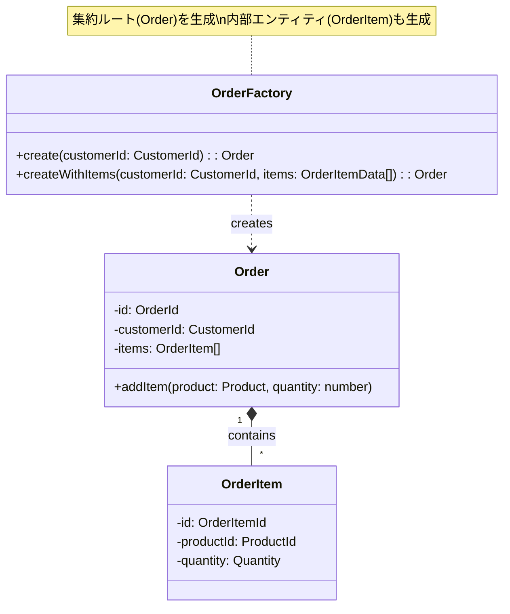
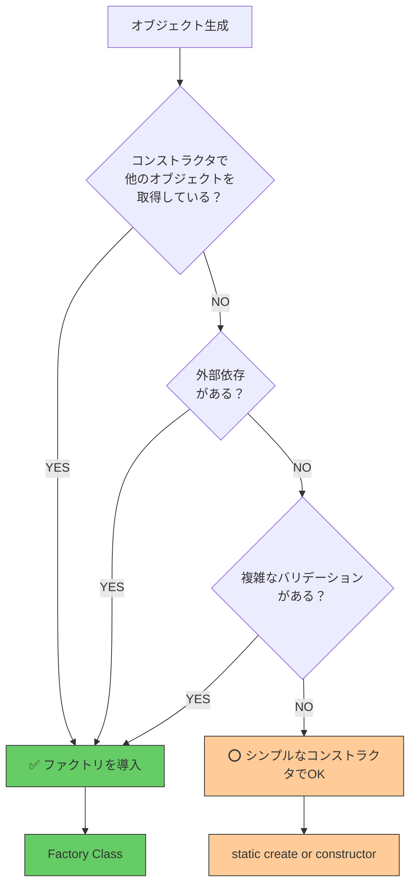
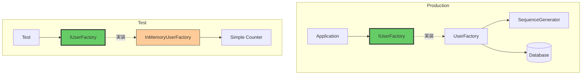

## ファクトリとは

複雑なオブジェクトの生成処理を抽象化し、ドメインモデルの責務を明確に保つファクトリパターンについて学びます。

## オブジェクト生成の問題

### コンストラクタの限界

オブジェクトを生成する最も基本的な方法はコンストラクタですが、生成処理が複雑になると問題が発生します。

```typescript
// ❌ 問題のある実装: コンストラクタで複雑な処理
export class User {
  private _id: UserId;
  private _name: UserName;

  constructor(name: UserName) {
    // ❌ コンストラクタでデータベース接続
    const db = new DatabaseConnection();
    const sequence = db.getNextSequence('user_id');
    this._id = new UserId(sequence);

    this._name = name;
  }
}
```

**問題点**:
- ❌ **低レベルの処理とドメインロジックが混在** - データベース接続はインフラの関心事
- ❌ **テストが困難** - コンストラクタを呼ぶだけでDB接続が必要
- ❌ **単一責任の原則に違反** - Userクラスの責務が肥大化



### 関心の分離の必要性



## ファクトリパターンとは

**ファクトリ（Factory）** は、複雑なオブジェクト生成処理を専門に扱うパターンです。

### ファクトリの責務

| 責務 | 説明 |
|------|------|
| **複雑な生成処理** | ID採番、バリデーション、依存オブジェクトの取得 |
| **生成ロジックのカプセル化** | 生成方法の詳細を隠蔽 |
| **ドメインの意図を表現** | 生成メソッド名でビジネス意図を明示 |

### ファクトリによる解決

```typescript
// domain/factories/IUserFactory.ts
export interface IUserFactory {
  // ✅ インターフェースで抽象化
  create(name: UserName): Promise<User>;
}

// infrastructure/factories/UserFactory.ts
export class UserFactory implements IUserFactory {
  constructor(
    private db: DatabaseConnection,
    private sequenceGenerator: SequenceGenerator
  ) {}

  async create(name: UserName): Promise<User> {
    // ✅ 複雑な処理はファクトリに集約
    const id = await this.sequenceGenerator.next('user_id');

    // ユーザーのコンストラクタはシンプルに
    return new User(new UserId(id), name);
  }
}

// domain/models/User.ts
export class User {
  private _id: UserId;
  private _name: UserName;

  // ✅ コンストラクタは受け取った値をセットするだけ
  constructor(id: UserId, name: UserName) {
    this._id = id;
    this._name = name;
  }

  get id(): UserId {
    return this._id;
  }

  get name(): UserName {
    return this._name;
  }
}
```

## ファクトリとリポジトリの違い

Chapter 9で学んだリポジトリとファクトリの違いを理解しましょう。



### Factory vs Repository

| 観点 | Factory | Repository |
|------|---------|------------|
| **目的** | 新規オブジェクトの生成 | 永続化されたオブジェクトの再構築 |
| **入力** | ビジネスデータ（名前など） | 識別子（ID） |
| **出力** | 新しいオブジェクト | 既存のオブジェクト |
| **DB状態** | まだ保存されていない | すでに保存済み |

```typescript
// ✅ Factory: 新規生成
const user = await userFactory.create(new UserName('Alice'));
// user.id は新しく採番されたID
// まだDBには保存されていない

await userRepository.save(user); // Repositoryで保存

// ✅ Repository: 再構築
const existingUser = await userRepository.findById(userId);
// DBから既存のユーザーを取得
```

## ファクトリの種類

### 1. ファクトリメソッド（Static Create）

Chapter 5（値オブジェクト）で学んだ `static create()` パターンです。

```typescript
// Chapter 5の復習: 値オブジェクトのファクトリメソッド
export class Money {
  private constructor(
    private _amount: number,
    private _currency: Currency
  ) {}

  // ✅ ファクトリメソッド
  static create(amount: number, currency: Currency): Money {
    if (amount < 0) {
      throw new Error('金額は0以上である必要があります');
    }
    return new Money(amount, currency);
  }
}

// 使用例
const price = Money.create(1000, Currency.JPY);
```

**特徴**:
- ✅ クラス自身がファクトリの役割を持つ
- ✅ シンプルで使いやすい
- ❌ 複雑な外部依存（DB接続など）を扱いにくい

### 2. ファクトリクラス

複雑な生成処理を専門のクラスに分離します。

```typescript
// ✅ ファクトリクラス
export class UserFactory implements IUserFactory {
  constructor(
    private sequenceGenerator: SequenceGenerator,
    private validator: UserValidator
  ) {}

  async create(name: UserName): Promise<User> {
    // 複雑な処理: ID採番
    const id = await this.sequenceGenerator.next('user_id');

    // 複雑な処理: バリデーション
    await this.validator.validateNewUser(name);

    // シンプルなコンストラクタ呼び出し
    return new User(new UserId(id), name);
  }
}
```

**特徴**:
- ✅ 複雑な外部依存を扱える
- ✅ テスト可能（モック差し替え可能）
- ✅ 生成ロジックの変更が容易

## ファクトリと集約

Chapter 8で学んだ集約との関係を見ていきましょう。



**重要な原則**:
- ✅ **ファクトリは集約ルート全体を生成** - 内部エンティティも含めて
- ✅ **1集約 = 1ファクトリ** - Orderファクトリが集約全体を生成
- ❌ 内部エンティティ（OrderItem）専用のファクトリは作らない

```typescript
export class OrderFactory implements IOrderFactory {
  async create(customerId: CustomerId): Promise<Order> {
    const orderId = await this.generateOrderId();

    // ✅ 集約ルート全体を生成
    return new Order(orderId, customerId, []);
  }

  async createWithItems(
    customerId: CustomerId,
    itemsData: OrderItemData[]
  ): Promise<Order> {
    const orderId = await this.generateOrderId();

    // ✅ 内部エンティティ(OrderItem)も含めて生成
    const items = itemsData.map(data =>
      new OrderItem(
        new OrderItemId(data.productId),
        data.productId,
        new Quantity(data.quantity)
      )
    );

    return new Order(orderId, customerId, items);
  }

  private async generateOrderId(): Promise<OrderId> {
    const id = await this.sequenceGenerator.next('order_id');
    return new OrderId(id);
  }
}
```

## ファクトリ導入の判断基準



### ファクトリが必要なケース

- ✅ **外部システムへの依存** - DB、API、ファイルシステムなど
- ✅ **複雑なID採番** - シーケンス、UUID、外部API
- ✅ **複雑なバリデーション** - 重複チェック、外部検証
- ✅ **複数ステップの処理** - 段階的な構築が必要

### シンプルなコンストラクタで十分なケース

- ⭕ **値オブジェクト** - 外部依存がない
- ⭕ **シンプルなエンティティ** - ID採番が不要（再構築時など）
- ⭕ **テストデータ** - 決まった値で生成

## テスト容易性

ファクトリパターンの大きなメリットはテストの容易さです。



```typescript
// test/factories/InMemoryUserFactory.ts
export class InMemoryUserFactory implements IUserFactory {
  private idCounter = 1;

  async create(name: UserName): Promise<User> {
    // ✅ DBなし、シンプルなカウンター
    const id = new UserId(this.idCounter++);
    return new User(id, name);
  }

  // テスト用ヘルパー
  reset(): void {
    this.idCounter = 1;
  }
}

// test/services/UserService.test.ts
describe('UserService', () => {
  let userFactory: InMemoryUserFactory;
  let userService: UserService;

  beforeEach(() => {
    userFactory = new InMemoryUserFactory();
    userService = new UserService(userFactory);
  });

  it('should create user', async () => {
    // ✅ 高速、DBなし、独立したテスト
    const user = await userService.registerUser(new UserName('Alice'));

    expect(user.name.value).toBe('Alice');
    expect(user.id.value).toBe(1);
  });
});
```

## まとめ

### ファクトリの役割

| 役割 | 説明 |
|------|------|
| **複雑な生成処理の抽象化** | ID採番、バリデーション、依存オブジェクトの取得 |
| **関心の分離** | ドメインモデルから生成ロジックを分離 |
| **テスト容易性** | モック差し替えで高速テスト |
| **意図の明確化** | createWithItems など、意図を表すメソッド名 |

### Factory vs Repository vs Constructor

| 観点 | Factory | Repository | Constructor |
|------|---------|------------|-------------|
| **用途** | 新規生成 | 永続化・再構築 | 初期化 |
| **複雑度** | 高 | 高 | 低 |
| **外部依存** | あり | あり | なし |
| **テスト** | モック可能 | モック可能 | 直接呼び出し |

### 重要な原則

- ✅ **コンストラクタはシンプルに** - 受け取った値をセットするだけ
- ✅ **複雑な処理はファクトリへ** - 外部依存、ID採番、バリデーション
- ✅ **ファクトリは集約全体を生成** - 内部エンティティも含めて
- ✅ **インターフェースで抽象化** - テスト可能性を確保
- ❌ **コンストラクタで他のオブジェクトを取得しない** - ファクトリ導入のサイン

**原則**: ファクトリは **複雑な生成処理を専門に扱い**、**ドメインモデルをシンプルに保つ**
