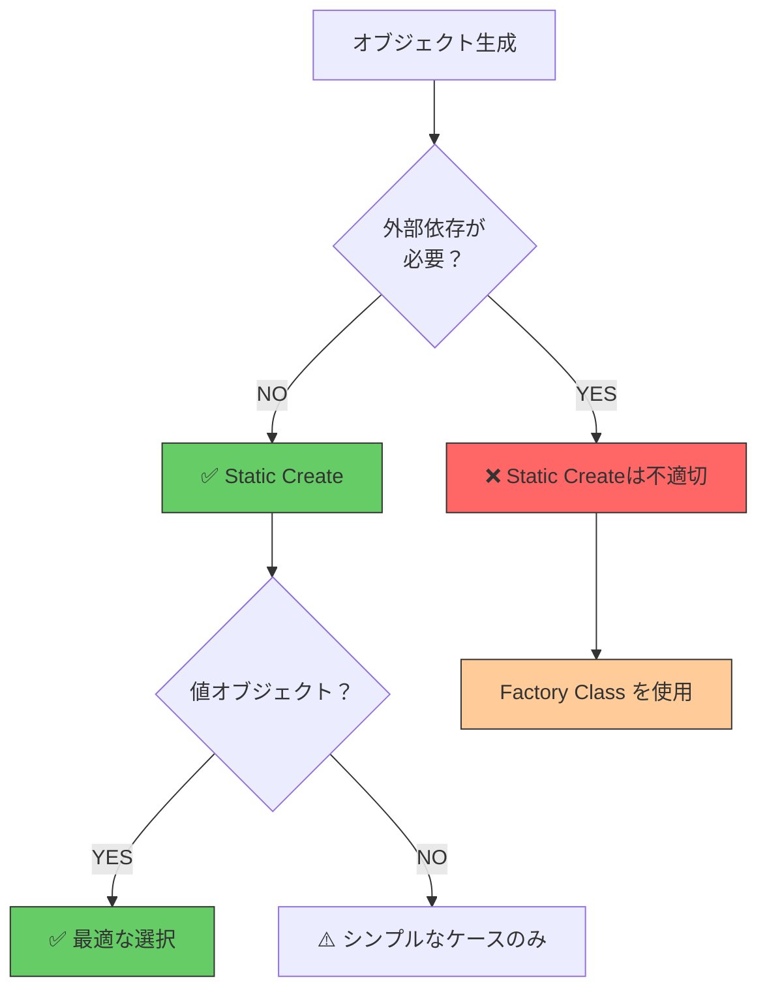
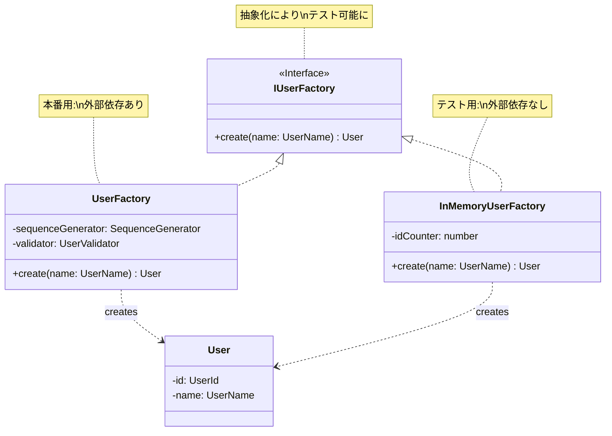
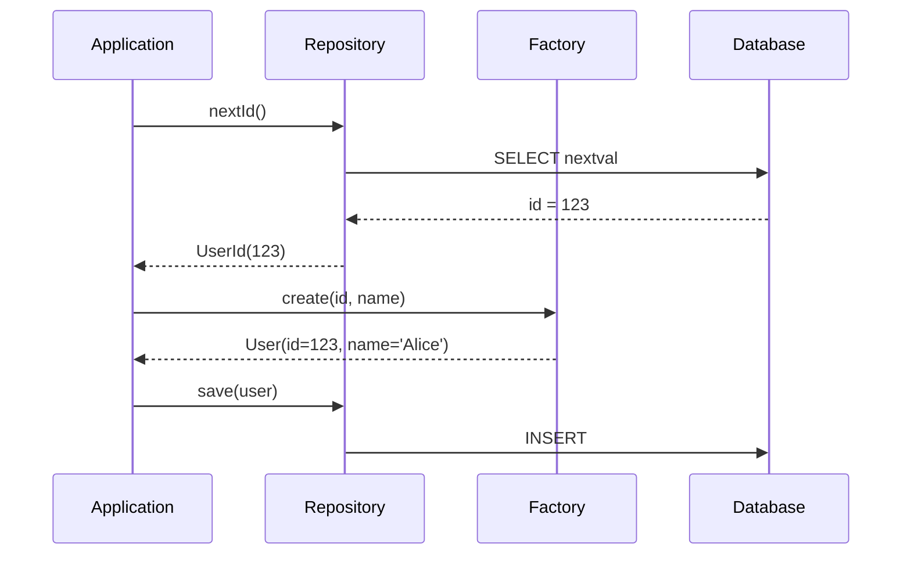
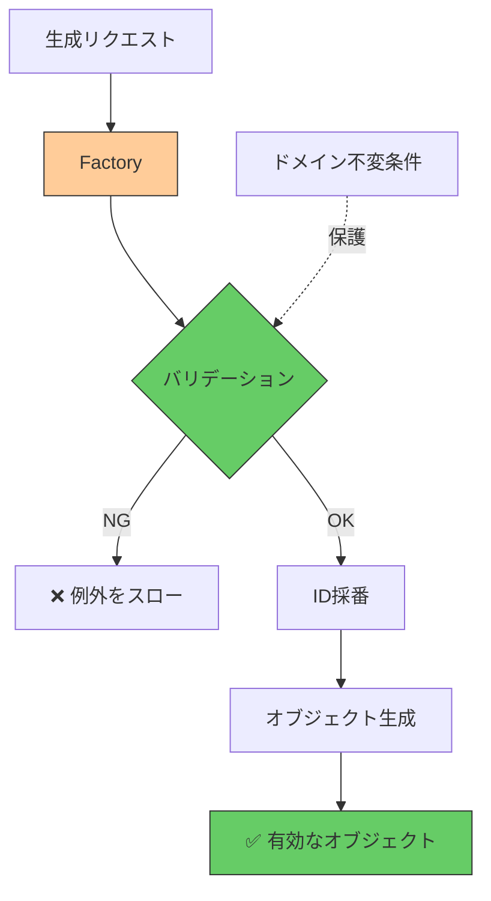
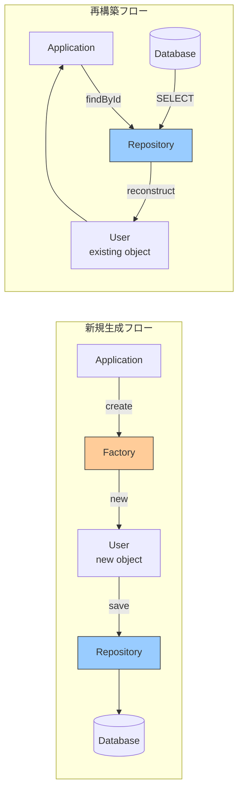

## ファクトリの実装パターン

ファクトリパターンの具体的な実装方法、ID採番戦略、バリデーション、そしてリポジトリとの協調について学びます。

## ファクトリメソッドパターン

### Static Createパターン

最もシンプルなファクトリパターンです。Chapter 5で学んだ値オブジェクトで使用しました。

```typescript
export class Money {
  private constructor(
    private _amount: number,
    private _currency: Currency
  ) {}

  // ✅ ファクトリメソッド
  static create(amount: number, currency: Currency): Money {
    if (amount < 0) {
      throw new Error('金額は0以上である必要があります');
    }

    return new Money(amount, currency);
  }

  get amount(): number {
    return this._amount;
  }

  get currency(): Currency {
    return this._currency;
  }
}

// 使用例
const price = Money.create(1000, Currency.JPY); // ✅ create経由で生成
// const invalid = new Money(-100, Currency.JPY); // ❌ privateなのでエラー
```

**メリット**:
- ✅ シンプルで理解しやすい
- ✅ バリデーションを強制できる
- ✅ コンストラクタをprivateにして不正な生成を防止

**デメリット**:
- ❌ 外部依存（DB、APIなど）を扱いにくい
- ❌ 複雑なロジックには不向き

### ファクトリメソッドの使い分け



## ファクトリクラスパターン

複雑な生成処理を専門のクラスに分離します。

### 基本的な実装



```typescript
// domain/factories/IUserFactory.ts
export interface IUserFactory {
  create(name: UserName): Promise<User>;
}

// infrastructure/factories/UserFactory.ts
export class UserFactory implements IUserFactory {
  constructor(
    private sequenceGenerator: SequenceGenerator,
    private validator: UserValidator
  ) {}

  async create(name: UserName): Promise<User> {
    // 1. バリデーション
    await this.validator.validateNewUser(name);

    // 2. ID採番
    const id = await this.sequenceGenerator.next('user_id');

    // 3. オブジェクト生成
    return new User(new UserId(id), name);
  }
}

// test/factories/InMemoryUserFactory.ts
export class InMemoryUserFactory implements IUserFactory {
  private idCounter = 1;

  async create(name: UserName): Promise<User> {
    const id = new UserId(this.idCounter++);
    return new User(id, name);
  }

  reset(): void {
    this.idCounter = 1;
  }
}
```

## ID採番の実装パターン

### パターン1: UUIDを使う

```typescript
import { v4 as uuidv4 } from 'uuid';

export class UuidUserFactory implements IUserFactory {
  async create(name: UserName): Promise<User> {
    // ✅ UUIDで一意なIDを生成
    const id = new UserId(uuidv4());
    return new User(id, name);
  }
}

// 使用例
const user = await factory.create(new UserName('Alice'));
// user.id.value = '123e4567-e89b-12d3-a456-426614174000'
```

**メリット**:
- ✅ DBアクセス不要
- ✅ 分散システムでも一意性保証
- ✅ 高速

**デメリット**:
- ❌ IDが長い（36文字）
- ❌ 順序性がない

### パターン2: データベースシーケンス

```typescript
export class SequenceUserFactory implements IUserFactory {
  constructor(
    private sequenceGenerator: SequenceGenerator
  ) {}

  async create(name: UserName): Promise<User> {
    // ✅ DBのシーケンスから採番
    const id = await this.sequenceGenerator.next('user_id');

    return new User(new UserId(id), name);
  }
}

// infrastructure/SequenceGenerator.ts
export class SequenceGenerator {
  constructor(private prisma: PrismaClient) {}

  async next(sequenceName: string): Promise<number> {
    // PostgreSQLのシーケンス利用
    const result = await this.prisma.$queryRaw<[{ nextval: bigint }]>`
      SELECT nextval(${sequenceName})
    `;

    return Number(result[0].nextval);
  }
}
```

**メリット**:
- ✅ IDが短い（数値）
- ✅ 順序性がある

**デメリット**:
- ❌ DBアクセスが必要
- ❌ 分散環境での調整が必要

### パターン3: リポジトリに採番メソッド



```typescript
// domain/repositories/IUserRepository.ts
export interface IUserRepository {
  save(user: User): Promise<void>;
  findById(id: UserId): Promise<User | null>;

  // ✅ 採番メソッド
  nextId(): Promise<UserId>;
}

// infrastructure/repositories/UserRepositoryImpl.ts
export class UserRepositoryImpl implements IUserRepository {
  constructor(private prisma: PrismaClient) {}

  async nextId(): Promise<UserId> {
    const id = await this.sequenceGenerator.next('user_id');
    return new UserId(id);
  }

  // ...
}

// 使用例（Application層）
const userId = await userRepository.nextId();
const user = new User(userId, new UserName('Alice'));
await userRepository.save(user);
```

**メリット**:
- ✅ ファクトリクラス不要
- ✅ シンプル

**デメリット**:
- ⚠️ リポジトリの責務が増える（永続化 + 採番）
- ⚠️ ファクトリとリポジトリが混在

## バリデーションとファクトリ

### ドメイン不変条件の保護

```typescript
export class CircleFactory implements ICircleFactory {
  constructor(
    private circleRepository: ICircleRepository,
    private sequenceGenerator: SequenceGenerator
  ) {}

  async create(
    name: CircleName,
    owner: User
  ): Promise<Circle> {
    // ✅ バリデーション: 重複チェック
    const existing = await this.circleRepository.findByName(name);
    if (existing !== null) {
      throw new Error(`サークル名 "${name.value}" は既に使用されています`);
    }

    // ID採番
    const id = await this.sequenceGenerator.next('circle_id');

    // 生成
    return new Circle(
      new CircleId(id),
      name,
      owner
    );
  }
}
```

### バリデーションの配置



**重要な原則**:
- ✅ **生成時にバリデーション** - 不正なオブジェクトは生成させない
- ✅ **ドメイン不変条件を保護** - 重複チェックなど
- ❌ **生成後のバリデーションは避ける** - 無効なオブジェクトが一時的に存在するリスク

## リポジトリとの協調

### 新規生成 vs 再構築



### Factory + Repository パターン

```typescript
// Application層
export class UserApplicationService {
  constructor(
    private userFactory: IUserFactory,
    private userRepository: IUserRepository
  ) {}

  // ✅ 新規登録: Factory + Repository
  async register(name: string): Promise<UserId> {
    const userName = new UserName(name);

    // 1. Factoryで生成
    const user = await this.userFactory.create(userName);

    // 2. Repositoryで保存
    await this.userRepository.save(user);

    return user.id;
  }

  // ✅ 更新: Repositoryで再構築 → 更新 → 保存
  async updateName(userId: UserId, newName: string): Promise<void> {
    // 1. Repositoryで取得
    const user = await this.userRepository.findById(userId);
    if (!user) {
      throw new Error('ユーザーが見つかりません');
    }

    // 2. ドメインモデルで更新
    user.changeName(new UserName(newName));

    // 3. Repositoryで保存
    await this.userRepository.save(user);
  }
}
```

## 再構築専用メソッド

Repositoryで既存データを復元する際は、Factoryではなく専用のコンストラクタを使います。

```typescript
export class User {
  private _id: UserId;
  private _name: UserName;
  private _createdAt: Date;

  // ✅ 新規生成用（Factoryから呼ばれる）
  constructor(id: UserId, name: UserName) {
    this._id = id;
    this._name = name;
    this._createdAt = new Date(); // ✅ 現在日時
  }

  // ✅ 再構築用（Repositoryから呼ばれる）
  static reconstruct(data: {
    id: UserId;
    name: UserName;
    createdAt: Date;
  }): User {
    const user = new User(data.id, data.name);
    user._createdAt = data.createdAt; // ✅ DBの値を使用
    return user;
  }

  get id(): UserId {
    return this._id;
  }

  get name(): UserName {
    return this._name;
  }

  get createdAt(): Date {
    return this._createdAt;
  }
}

// Repository
export class UserRepositoryImpl implements IUserRepository {
  async findById(id: UserId): Promise<User | null> {
    const userData = await this.prisma.user.findUnique({
      where: { id: id.value },
    });

    if (!userData) return null;

    // ✅ reconstruct を使用
    return User.reconstruct({
      id: new UserId(userData.id),
      name: new UserName(userData.name),
      createdAt: userData.createdAt,
    });
  }
}
```

## ファクトリメソッドによるカプセル化

オブジェクトが自身の内部情報を使って別のオブジェクトを生成するパターンです。

```typescript
// ✅ ファクトリメソッドでカプセル化
export class User {
  private _id: UserId;
  private _name: UserName;

  constructor(id: UserId, name: UserName) {
    this._id = id;
    this._name = name;
  }

  // ✅ 内部情報（_id）を使ってCircleを生成
  createCircle(name: CircleName): Circle {
    // 外部からは_idにアクセスできないが、
    // このメソッドを通じてCircleを生成できる
    return new Circle(
      this._id, // ✅ ownerId として使用
      name
    );
  }

  // ❌ ゲッターを公開する必要がない
  // get id(): UserId { return this._id; }
}

// 使用例
const user = await userFactory.create(new UserName('Alice'));

// ✅ user._id を公開せずにCircleを生成
const circle = user.createCircle(new CircleName('DDD勉強会'));

// ❌ 以下のような実装を避けられる
// const circle = new Circle(user.id, new CircleName('DDD勉強会'));
```

**メリット**:
- ✅ カプセル化を保持（IDゲッター不要）
- ✅ ドメインの意図が明確（"ユーザーがサークルを作る"）
- ✅ 関連オブジェクトの生成が安全

## 依存性の注入（DI）

ファクトリはDIコンテナで管理します。

```typescript
// infrastructure/di/container.ts
import { Container } from 'inversify';

const container = new Container();

// Factoryの登録
container.bind<IUserFactory>('IUserFactory').to(UserFactory);
container.bind<SequenceGenerator>('SequenceGenerator').to(SequenceGenerator);

// Repositoryの登録
container.bind<IUserRepository>('IUserRepository').to(UserRepositoryImpl);

// Application Serviceの登録
container
  .bind<UserApplicationService>('UserApplicationService')
  .to(UserApplicationService);

export { container };

// Application層での使用
const userService = container.get<UserApplicationService>('UserApplicationService');
await userService.register('Alice');
```

## まとめ

### ファクトリパターンの使い分け

| パターン | 適用場面 | 例 |
|---------|---------|---|
| **Static Create** | 値オブジェクト、外部依存なし | Money, Email |
| **Factory Class** | エンティティ、外部依存あり | UserFactory |
| **Factory Method** | カプセル化重視、関連生成 | user.createCircle() |

### ID採番戦略の選択

| 戦略 | メリット | デメリット |
|------|---------|-----------|
| **UUID** | DBアクセス不要、高速 | IDが長い |
| **DB Sequence** | IDが短い、順序性あり | DBアクセス必要 |
| **Repository.nextId()** | シンプル | 責務が混在 |

### 重要な原則

- ✅ **Factoryで生成、Repositoryで永続化** - 責務を分離
- ✅ **新規生成にFactory、再構築にreconstruct** - 目的を明確に
- ✅ **インターフェースで抽象化** - テスト可能に
- ✅ **バリデーションは生成時** - 不正なオブジェクトを作らせない
- ✅ **Factory Methodでカプセル化** - 内部情報を隠蔽

**原則**: ファクトリは **複雑な生成ロジックを隠蔽**し、**ドメインモデルの整合性を保護**する
