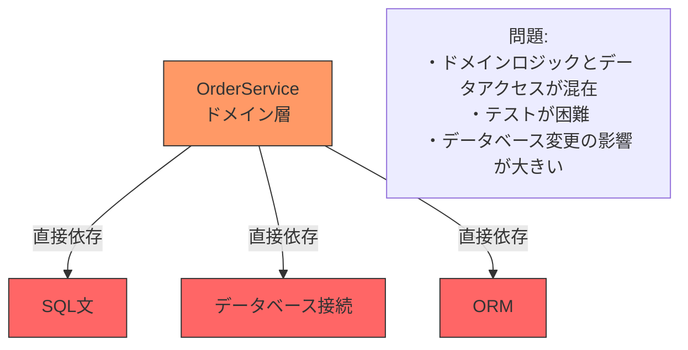
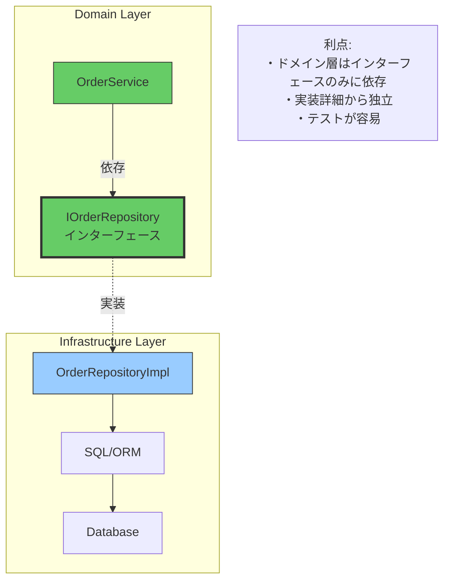
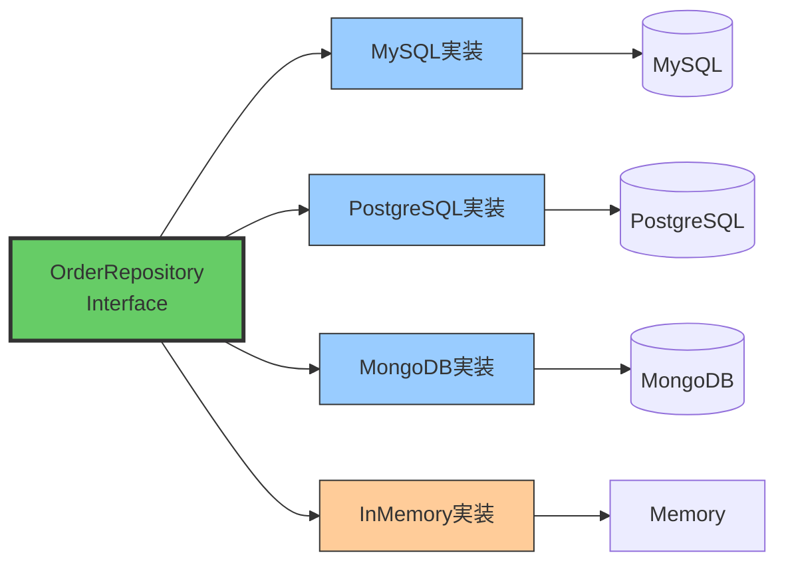
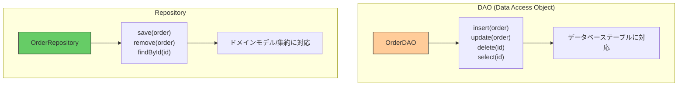
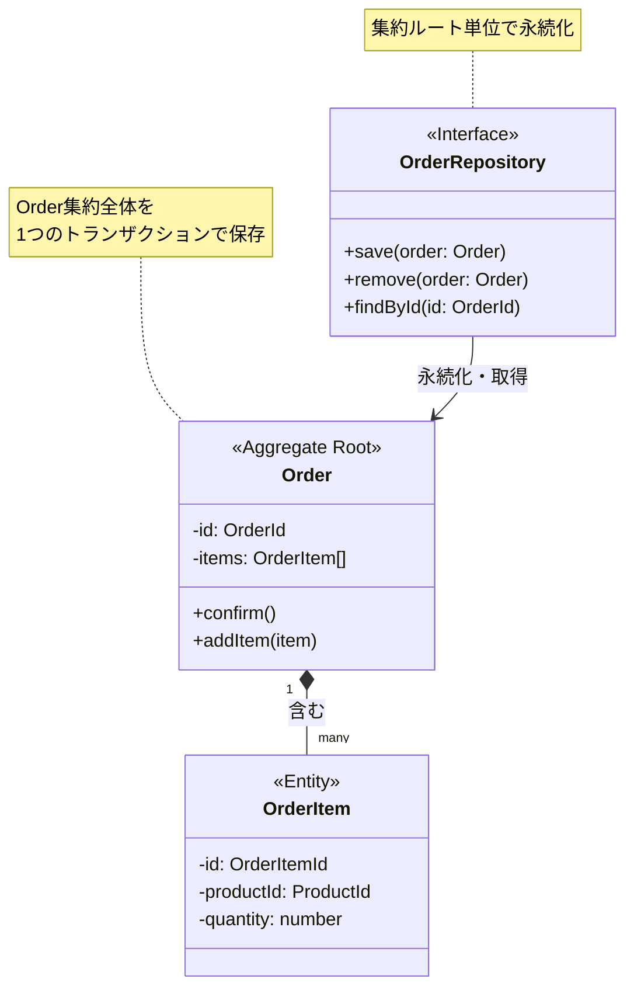

## リポジトリとは

**リポジトリ（Repository）** は、ドメインオブジェクトの永続化と取得を抽象化するパターンです。

## リポジトリが解決する問題

### ❌ 問題: ドメイン層がインフラストラクチャに依存



**問題点**:
- ドメインロジックにSQL文やデータベース接続コードが混在
- ユニットテストが困難（データベースが必須）
- データベース変更時の影響範囲が広い

### ✅ 解決: リポジトリでデータアクセスを抽象化



**利点**:
- ドメイン層はリポジトリインターフェースのみに依存
- データアクセスの実装詳細から独立
- モックを使ったテストが容易

## リポジトリの責務

### 1. コレクションのようなインターフェース

リポジトリは、あたかも **メモリ上のコレクション** のように扱えるインターフェースを提供します。

```typescript
// ✅ リポジトリ: コレクションのようなインターフェース
export interface OrderRepository {
  // 追加（永続化）
  save(order: Order): Promise<void>;

  // 削除
  remove(order: Order): Promise<void>;

  // IDで検索
  findById(id: OrderId): Promise<Order | null>;

  // 条件で検索
  findByCustomerId(customerId: CustomerId): Promise<Order[]>;

  // すべて取得
  findAll(): Promise<Order[]>;
}

// ドメインサービスでの使用例
export class OrderService {
  constructor(private orderRepo: OrderRepository) {}

  async confirmOrder(orderId: OrderId): Promise<void> {
    // コレクションから取得するように見える
    const order = await this.orderRepo.findById(orderId);
    if (!order) {
      throw new Error('Order not found');
    }

    // ドメインロジック実行
    order.confirm();

    // コレクションに保存するように見える
    await this.orderRepo.save(order);
  }
}
```

### 2. 永続化メカニズムの隠蔽

リポジトリは、SQL、NoSQL、ファイル、メモリなど、**どのように永続化されるかを隠蔽**します。



```typescript
// インフラストラクチャ層: MySQL実装
export class MySQLOrderRepository implements OrderRepository {
  async save(order: Order): Promise<void> {
    const sql = 'INSERT INTO orders ...';
    // MySQL固有の実装
  }

  async findById(id: OrderId): Promise<Order | null> {
    const sql = 'SELECT * FROM orders WHERE id = ?';
    // MySQL固有の実装
  }
}

// インフラストラクチャ層: InMemory実装（テスト用）
export class InMemoryOrderRepository implements OrderRepository {
  private orders: Map<string, Order> = new Map();

  async save(order: Order): Promise<void> {
    this.orders.set(order.id.value, order);
  }

  async findById(id: OrderId): Promise<Order | null> {
    return this.orders.get(id.value) || null;
  }
}
```

## リポジトリとDAOの違い



| 観点 | DAO | Repository |
|------|-----|-----------|
| **目的** | データベース操作の抽象化 | ドメインモデルの永続化抽象化 |
| **対応単位** | テーブル | 集約 |
| **メソッド名** | insert, update, delete, select | save, remove, find |
| **層** | 主にインフラストラクチャ | ドメイン（Interface）+ インフラ（実装） |
| **テーブル数** | 1テーブル = 1DAO | 1集約 = 1Repository（複数テーブル可） |

### DAO（アンチパターン）

```typescript
// ❌ DAO: テーブル中心
export class OrderDAO {
  insert(orderData: OrderRow): void {
    // INSERT INTO orders ...
  }

  update(orderData: OrderRow): void {
    // UPDATE orders SET ...
  }

  selectById(id: number): OrderRow | null {
    // SELECT * FROM orders WHERE id = ?
  }
}

export class OrderItemDAO {
  insertItems(items: OrderItemRow[]): void {
    // INSERT INTO order_items ...
  }
}

// 問題: ドメインロジックでテーブル構造を意識
async function confirmOrder(orderId: number): Promise<void> {
  const orderRow = orderDAO.selectById(orderId);
  orderRow.status = 'confirmed';
  orderDAO.update(orderRow);

  // 複数のDAOを操作する必要がある
  orderItemDAO.updateStatus(orderId, 'confirmed');
}
```

### Repository（推奨）

```typescript
// ✅ Repository: 集約中心
export interface OrderRepository {
  save(order: Order): Promise<void>;
  findById(id: OrderId): Promise<Order | null>;
}

// ドメインロジックはモデルに集中
async function confirmOrder(orderId: OrderId): Promise<void> {
  const order = await orderRepo.findById(orderId);

  // ドメインモデルのメソッドを使用
  order.confirm();

  // リポジトリは集約全体を永続化（ordersとorder_itemsテーブル両方）
  await orderRepo.save(order);
}
```

## リポジトリと集約の関係



**重要な原則**:
- ✅ **1集約 = 1リポジトリ**
- ✅ リポジトリは **集約ルート** のみを対象
- ❌ 内部エンティティ（OrderItem）専用のリポジトリは作らない

## まとめ

### リポジトリの特徴

| 特徴 | 説明 |
|------|------|
| **コレクション指向** | メモリ上のコレクションのように扱える |
| **永続化の抽象化** | SQL/NoSQL/メモリなど実装を隠蔽 |
| **集約単位** | 集約ルートごとに1つのリポジトリ |
| **ドメイン層に配置** | インターフェースはドメイン層 |
| **実装は分離** | 実装はインフラストラクチャ層 |

### 利点

- ✅ ドメイン層がインフラストラクチャから独立
- ✅ テストが容易（モック可能）
- ✅ データベース変更の影響を局所化
- ✅ ドメインロジックがシンプルに
- ✅ トランザクション境界が明確

**原則**: リポジトリは **永続化の詳細を隠蔽** し、ドメインモデルをコレクションのように扱えるようにする
