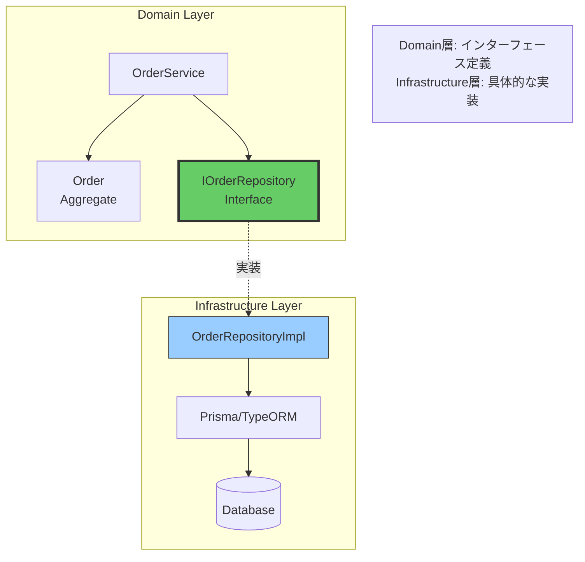
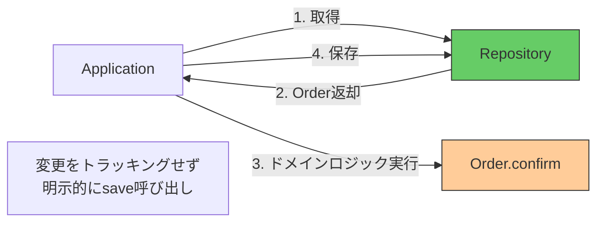
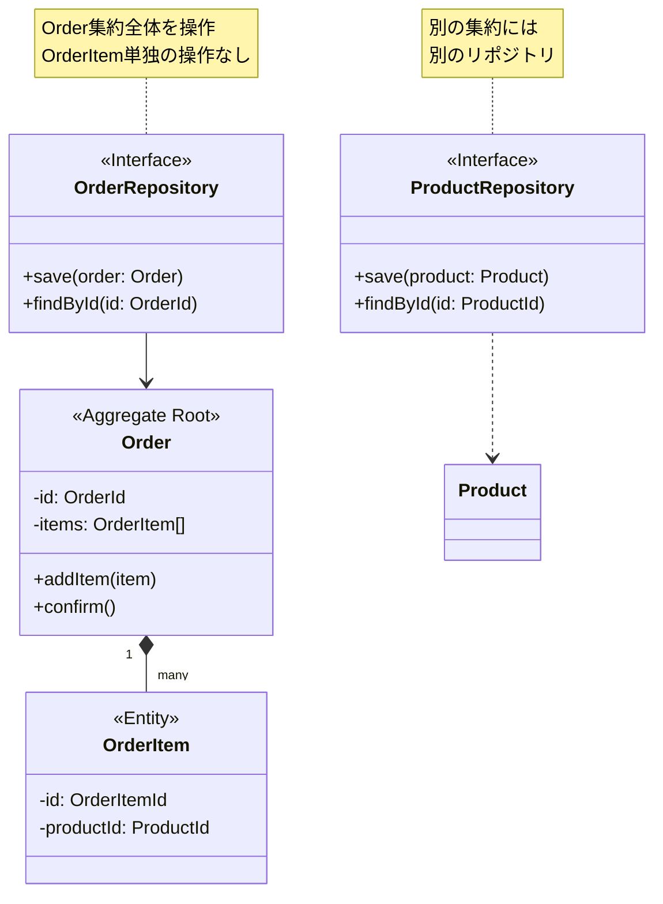
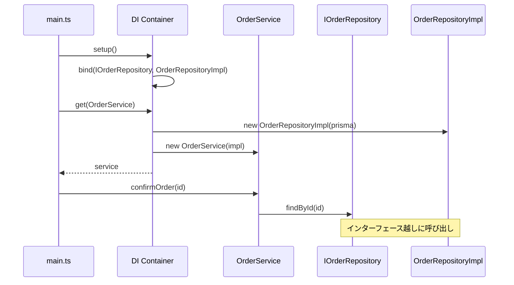

## リポジトリの実装パターン

リポジトリの実装方法と、Domain層とInfrastructure層の適切な分離について学びます。

## 層の分離: Interface と Implementation



### Domain層: インターフェース定義

```typescript
// domain/repositories/IOrderRepository.ts
import { Order } from '../models/Order';
import { OrderId } from '../value-objects/OrderId';
import { CustomerId } from '../value-objects/CustomerId';

export interface IOrderRepository {
  // 永続化
  save(order: Order): Promise<void>;

  // 削除
  remove(order: Order): Promise<void>;

  // ID検索
  findById(id: OrderId): Promise<Order | null>;

  // 顧客ID検索
  findByCustomerId(customerId: CustomerId): Promise<Order[]>;

  // 次のID生成（シーケンス等）
  nextId(): Promise<OrderId>;
}
```

### Infrastructure層: 具体的な実装

```typescript
// infrastructure/repositories/OrderRepositoryImpl.ts
import { IOrderRepository } from '@/domain/repositories/IOrderRepository';
import { Order } from '@/domain/models/Order';
import { PrismaClient } from '@prisma/client';

export class OrderRepositoryImpl implements IOrderRepository {
  constructor(private prisma: PrismaClient) {}

  async save(order: Order): Promise<void> {
    // Order集約全体を永続化
    await this.prisma.$transaction(async (tx) => {
      // 1. Orderテーブルに保存
      await tx.order.upsert({
        where: { id: order.id.value },
        create: {
          id: order.id.value,
          customerId: order.customerId.value,
          status: order.status,
          totalAmount: order.totalAmount.value,
        },
        update: {
          status: order.status,
          totalAmount: order.totalAmount.value,
        },
      });

      // 2. OrderItemsテーブルに保存（集約内のエンティティ）
      await tx.orderItem.deleteMany({
        where: { orderId: order.id.value },
      });

      for (const item of order.items) {
        await tx.orderItem.create({
          data: {
            id: item.id.value,
            orderId: order.id.value,
            productId: item.productId.value,
            quantity: item.quantity,
            unitPrice: item.unitPrice.value,
          },
        });
      }
    });
  }

  async findById(id: OrderId): Promise<Order | null> {
    const orderData = await this.prisma.order.findUnique({
      where: { id: id.value },
      include: { items: true }, // 集約全体を取得
    });

    if (!orderData) return null;

    // ドメインモデルに再構築
    return Order.reconstruct({
      id: new OrderId(orderData.id),
      customerId: new CustomerId(orderData.customerId),
      items: orderData.items.map(item =>
        OrderItem.reconstruct({
          id: new OrderItemId(item.id),
          productId: new ProductId(item.productId),
          quantity: item.quantity,
          unitPrice: new Money(item.unitPrice),
        })
      ),
      status: orderData.status,
      totalAmount: new Money(orderData.totalAmount),
    });
  }

  async nextId(): Promise<OrderId> {
    // UUID生成
    return OrderId.generate();
  }
}
```

## コレクション指向 vs 永続化指向

### コレクション指向リポジトリ（推奨）



```typescript
// ✅ コレクション指向: シンプルで明示的
export interface IOrderRepository {
  save(order: Order): Promise<void>;
  findById(id: OrderId): Promise<Order | null>;
}

// 使用例
async function confirmOrder(orderId: OrderId): Promise<void> {
  const order = await orderRepo.findById(orderId);

  order.confirm(); // ドメインロジック

  await orderRepo.save(order); // 明示的に保存
}
```

### 永続化指向リポジトリ（ORMの影響）

```typescript
// ❌ 永続化指向: 暗黙的で複雑
export interface IOrderRepository {
  findById(id: OrderId): Promise<Order | null>;
  // saveメソッドなし - ORMが自動追跡
}

// 使用例（アンチパターン）
async function confirmOrder(orderId: OrderId): Promise<void> {
  const order = await orderRepo.findById(orderId);

  order.confirm(); // 変更が自動的にDBに反映される？

  // saveの呼び出し不要？ 不明確！
}
```

**問題点**:
- 変更が保存されるタイミングが不明確
- トランザクション境界が曖昧
- テストが困難

## 集約単位のリポジトリ設計



### ✅ 良い例: 集約単位

```typescript
// ✅ Order集約用のリポジトリ
export interface IOrderRepository {
  save(order: Order): Promise<void>; // Order集約全体を保存
  remove(order: Order): Promise<void>; // Order集約全体を削除
  findById(id: OrderId): Promise<Order | null>; // Order集約全体を取得
}

// ✅ Product集約用のリポジトリ
export interface IProductRepository {
  save(product: Product): Promise<void>;
  findById(id: ProductId): Promise<Product | null>;
}
```

### ❌ 悪い例: エンティティごと

```typescript
// ❌ OrderItem専用のリポジトリ（不要）
export interface IOrderItemRepository {
  save(item: OrderItem): Promise<void>;
  findById(id: OrderItemId): Promise<OrderItem | null>;
}

// 問題: Order集約の整合性を破壊する可能性
async function badExample(): Promise<void> {
  const item = await orderItemRepo.findById(itemId);
  item.changeQuantity(10); // Order集約を経由せずに変更！
  await orderItemRepo.save(item); // 不変条件をバイパス！
}
```

## 依存性注入との組み合わせ



```typescript
// main.ts または DI設定ファイル
import { Container } from 'inversify';
import { IOrderRepository } from '@/domain/repositories/IOrderRepository';
import { OrderRepositoryImpl } from '@/infrastructure/repositories/OrderRepositoryImpl';

const container = new Container();

// インターフェースと実装をバインド
container
  .bind<IOrderRepository>('IOrderRepository')
  .to(OrderRepositoryImpl);

// OrderServiceは自動的にOrderRepositoryImplを受け取る
container.bind(OrderService).toSelf();

export { container };
```

```typescript
// application/services/OrderService.ts
import { injectable, inject } from 'inversify';
import { IOrderRepository } from '@/domain/repositories/IOrderRepository';

@injectable()
export class OrderService {
  constructor(
    @inject('IOrderRepository')
    private orderRepo: IOrderRepository // インターフェースに依存
  ) {}

  async confirmOrder(orderId: OrderId): Promise<void> {
    const order = await this.orderRepo.findById(orderId);
    order.confirm();
    await this.orderRepo.save(order);
  }
}
```

## トランザクション管理

```typescript
// infrastructure/repositories/OrderRepositoryImpl.ts
export class OrderRepositoryImpl implements IOrderRepository {
  async save(order: Order): Promise<void> {
    // ✅ トランザクションで集約全体を保存
    await this.prisma.$transaction(async (tx) => {
      // Orderテーブル
      await tx.order.upsert({...});

      // OrderItemsテーブル（集約内のエンティティ）
      await tx.orderItem.deleteMany({...});
      for (const item of order.items) {
        await tx.orderItem.create({...});
      }

      // その他の集約内データも同じトランザクション内で
    });
    // トランザクション境界 = 集約境界
  }
}
```

## まとめ

### リポジトリ実装の原則

| 原則 | 説明 |
|------|------|
| **Interface/Implementation分離** | Domain層: Interface、Infrastructure層: 実装 |
| **コレクション指向** | 明示的なsave/findメソッド |
| **集約単位** | 1集約 = 1リポジトリ |
| **トランザクション境界** | 集約全体を1トランザクションで永続化 |
| **DI活用** | インターフェースに依存、実装は注入 |

### ベストプラクティス

- ✅ インターフェースをDomain層に配置
- ✅ 実装をInfrastructure層に配置
- ✅ 集約ルートのみをリポジトリで扱う
- ✅ トランザクションで集約全体を保存
- ✅ ドメインモデルへの再構築を実装
- ❌ ORMの自動追跡に依存しない
- ❌ 内部エンティティ専用リポジトリを作らない

**原則**: リポジトリは **集約全体を1単位** として扱い、**インターフェースと実装を分離** する
