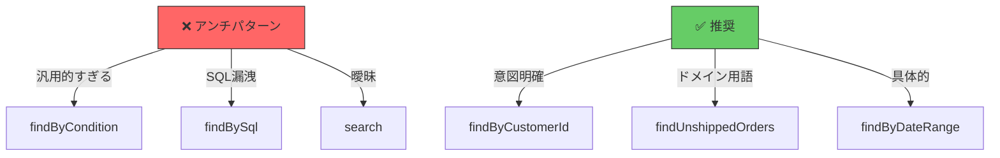
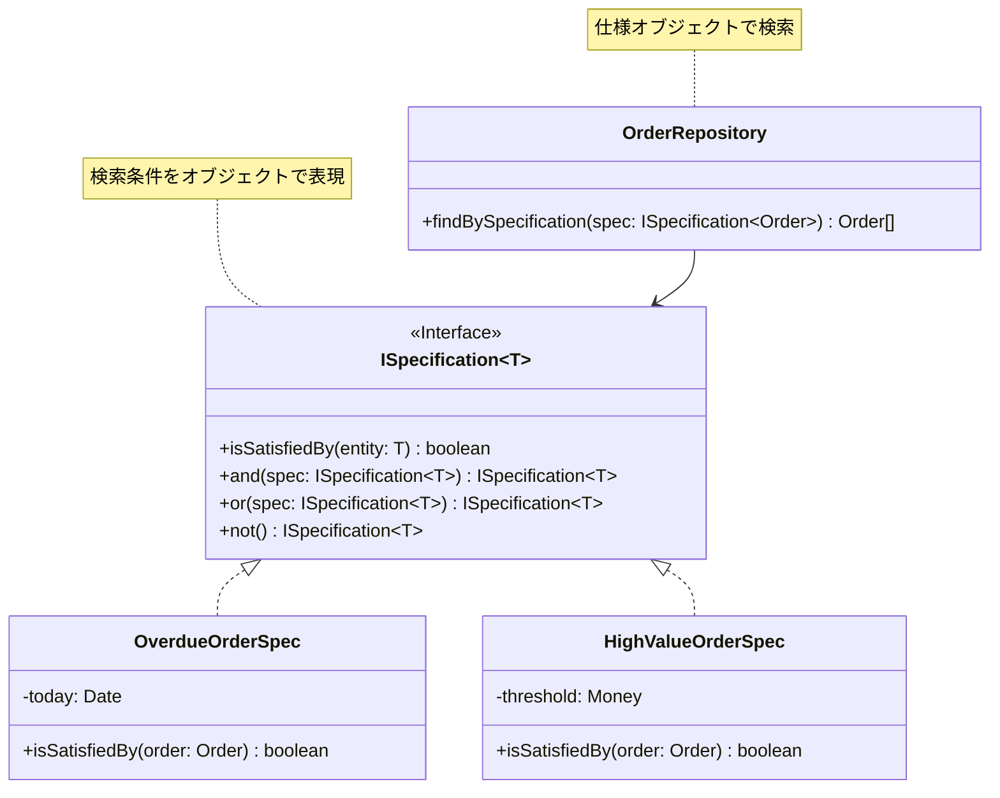
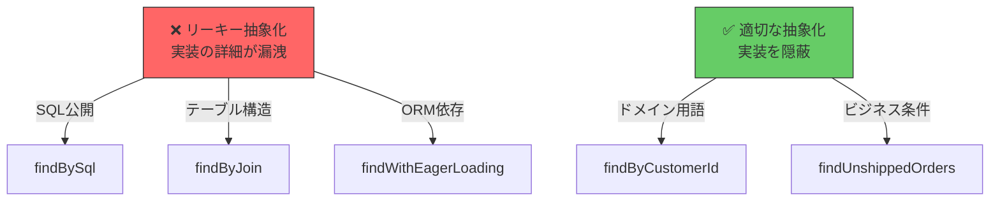
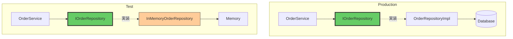

## リポジトリ設計のベストプラクティス

効果的なリポジトリ設計のパターン、クエリメソッドの設計、そして避けるべきアンチパターンを学びます。

## クエリメソッド設計

### 意図を明確にする命名

```typescript
// ✅ 良い例: 意図が明確
export interface IOrderRepository {
  // 単数取得
  findById(id: OrderId): Promise<Order | null>;

  // 複数取得（顧客の全注文）
  findByCustomerId(customerId: CustomerId): Promise<Order[]>;

  // 条件検索（未発送の注文）
  findUnshippedOrders(): Promise<Order[]>;

  // 条件検索（期間指定）
  findByDateRange(start: Date, end: Date): Promise<Order[]>;

  // 存在確認
  exists(id: OrderId): Promise<boolean>;

  // カウント
  countByStatus(status: OrderStatus): Promise<number>;
}

// ❌ 悪い例: 曖昧な命名
export interface IOrderRepository {
  get(id: string): Promise<Order | null>; // get? find? fetch?
  getOrders(customerId: string): Promise<Order[]>; // どの条件？
  query(sql: string): Promise<Order[]>; // SQLを直接渡す？
}
```

### 汎用クエリメソッドのアンチパターン



```typescript
// ❌ アンチパターン: 汎用的すぎるメソッド
export interface IOrderRepository {
  // 問題: どんな条件も受け入れる → ドメイン知識が失われる
  findByCondition(condition: object): Promise<Order[]>;

  // 問題: SQLが漏洩 → リポジトリの抽象化が破綻
  findBySql(sql: string): Promise<Order[]>;

  // 問題: 何を検索するのか不明確
  search(query: string): Promise<Order[]>;
}

// ✅ 推奨: 意図が明確なメソッド
export interface IOrderRepository {
  // ドメイン用語を使用
  findByCustomerId(customerId: CustomerId): Promise<Order[]>;
  findUnshippedOrders(): Promise<Order[]>;
  findOverdueOrders(today: Date): Promise<Order[]>;
}
```

## 仕様パターン（Specification Pattern）

複雑な検索条件を表現する場合、仕様パターンを使います。



### 仕様パターンの実装

```typescript
// domain/specifications/ISpecification.ts
export interface ISpecification<T> {
  isSatisfiedBy(entity: T): boolean;
  and(spec: ISpecification<T>): ISpecification<T>;
  or(spec: ISpecification<T>): ISpecification<T>;
  not(): ISpecification<T>;
}

// domain/specifications/OverdueOrderSpecification.ts
export class OverdueOrderSpecification implements ISpecification<Order> {
  constructor(private today: Date) {}

  isSatisfiedBy(order: Order): boolean {
    return order.dueDate < this.today && !order.isShipped();
  }

  and(spec: ISpecification<Order>): ISpecification<Order> {
    return new AndSpecification(this, spec);
  }

  // or, not も同様に実装
}

// domain/specifications/HighValueOrderSpecification.ts
export class HighValueOrderSpecification implements ISpecification<Order> {
  constructor(private threshold: Money) {}

  isSatisfiedBy(order: Order): boolean {
    return order.totalAmount.isGreaterThan(this.threshold);
  }
}

// domain/repositories/IOrderRepository.ts
export interface IOrderRepository {
  // 仕様パターンを使った検索
  findBySpecification(spec: ISpecification<Order>): Promise<Order[]>;
}

// 使用例
async function findProblematicOrders(): Promise<Order[]> {
  const overdueSpec = new OverdueOrderSpecification(new Date());
  const highValueSpec = new HighValueOrderSpecification(new Money(100000));

  // 仕様を組み合わせる
  const combinedSpec = overdueSpec.and(highValueSpec);

  // 期限切れかつ高額な注文を検索
  return await orderRepo.findBySpecification(combinedSpec);
}
```

### 仕様パターンの実装（Infrastructure層）

```typescript
// infrastructure/repositories/OrderRepositoryImpl.ts
export class OrderRepositoryImpl implements IOrderRepository {
  async findBySpecification(
    spec: ISpecification<Order>
  ): Promise<Order[]> {
    // 1. すべての注文を取得（または効率的なクエリ）
    const allOrders = await this.findAll();

    // 2. メモリ上で仕様を適用
    return allOrders.filter(order => spec.isSatisfiedBy(order));
  }

  // より効率的な実装: SQLに変換
  async findBySpecification(
    spec: ISpecification<Order>
  ): Promise<Order[]> {
    // 仕様オブジェクトをSQLに変換（高度な実装）
    const sqlBuilder = new SpecificationToSqlConverter();
    const sql = sqlBuilder.convert(spec);
    return await this.query(sql);
  }
}
```

## アンチパターンの回避

### アンチパターン1: リポジトリでビジネスロジック

```typescript
// ❌ 悪い例: リポジトリにビジネスロジック
export class OrderRepositoryImpl implements IOrderRepository {
  async confirmOrder(orderId: OrderId): Promise<void> {
    const order = await this.findById(orderId);

    // ❌ ビジネスロジックがリポジトリに！
    if (order.items.length === 0) {
      throw new Error('Cannot confirm empty order');
    }
    order.status = 'confirmed';

    await this.save(order);
  }
}

// ✅ 良い例: ビジネスロジックはドメインモデルまたはサービスに
export class Order {
  confirm(): void {
    // ✅ ビジネスルールはドメインモデルに
    if (this._items.length === 0) {
      throw new Error('Cannot confirm empty order');
    }
    this._status = OrderStatus.Confirmed;
  }
}

export class OrderRepositoryImpl implements IOrderRepository {
  // リポジトリは永続化のみ
  async save(order: Order): Promise<void> {
    // 永続化処理のみ
  }
}
```

### アンチパターン2: リーキー抽象化



```typescript
// ❌ 悪い例: 実装の詳細が漏洩
export interface IOrderRepository {
  // SQL文を直接渡す
  findBySql(sql: string): Promise<Order[]>;

  // ORMの機能が漏洩
  findWithEagerLoading(id: OrderId, relations: string[]): Promise<Order | null>;

  // テーブル構造が漏洩
  findByJoin(table: string, condition: string): Promise<Order[]>;
}

// ✅ 良い例: 実装を完全に隠蔽
export interface IOrderRepository {
  // ドメイン用語のみ
  findById(id: OrderId): Promise<Order | null>;
  findByCustomerId(customerId: CustomerId): Promise<Order[]>;
  findUnshippedOrders(): Promise<Order[]>;
}
```

### アンチパターン3: N+1問題の無視

```typescript
// ❌ 悪い例: N+1問題
export class OrderRepositoryImpl implements IOrderRepository {
  async findById(id: OrderId): Promise<Order | null> {
    // 1. Orderのみ取得
    const orderData = await this.prisma.order.findUnique({
      where: { id: id.value },
      // include していない！
    });

    // 2. OrderItemsを別々に取得（N+1問題）
    const items = [];
    for (const itemId of orderData.itemIds) {
      const item = await this.prisma.orderItem.findUnique({
        where: { id: itemId },
      }); // N回のクエリ！
      items.push(item);
    }

    return Order.reconstruct({ ...orderData, items });
  }
}

// ✅ 良い例: 集約全体を1クエリで取得
export class OrderRepositoryImpl implements IOrderRepository {
  async findById(id: OrderId): Promise<Order | null> {
    const orderData = await this.prisma.order.findUnique({
      where: { id: id.value },
      include: { items: true }, // ✅ 1クエリで集約全体を取得
    });

    return Order.reconstruct({
      id: new OrderId(orderData.id),
      items: orderData.items.map(/* 変換 */),
      // ...
    });
  }
}
```

## ページネーションとソート

```typescript
// domain/repositories/IOrderRepository.ts
export interface PageRequest {
  page: number;
  pageSize: number;
  sortBy?: string;
  sortOrder?: 'asc' | 'desc';
}

export interface Page<T> {
  items: T[];
  totalCount: number;
  page: number;
  pageSize: number;
  totalPages: number;
}

export interface IOrderRepository {
  // ページネーション対応
  findByCustomerId(
    customerId: CustomerId,
    pageRequest: PageRequest
  ): Promise<Page<Order>>;
}

// 使用例
const orders = await orderRepo.findByCustomerId(
  customerId,
  {
    page: 1,
    pageSize: 20,
    sortBy: 'createdAt',
    sortOrder: 'desc',
  }
);

console.log(`Total: ${orders.totalCount}, Page: ${orders.page}/${orders.totalPages}`);
```

## テスト容易性



```typescript
// test/repositories/InMemoryOrderRepository.ts
export class InMemoryOrderRepository implements IOrderRepository {
  private orders: Map<string, Order> = new Map();

  async save(order: Order): Promise<void> {
    this.orders.set(order.id.value, order);
  }

  async findById(id: OrderId): Promise<Order | null> {
    return this.orders.get(id.value) || null;
  }

  async findByCustomerId(customerId: CustomerId): Promise<Order[]> {
    return Array.from(this.orders.values()).filter(
      order => order.customerId.equals(customerId)
    );
  }

  // テスト用のヘルパーメソッド
  clear(): void {
    this.orders.clear();
  }
}

// test/services/OrderService.test.ts
describe('OrderService', () => {
  let orderRepo: InMemoryOrderRepository;
  let orderService: OrderService;

  beforeEach(() => {
    orderRepo = new InMemoryOrderRepository();
    orderService = new OrderService(orderRepo);
  });

  it('should confirm order', async () => {
    const order = Order.create(customerId);
    await orderRepo.save(order);

    await orderService.confirmOrder(order.id);

    const updated = await orderRepo.findById(order.id);
    expect(updated.status).toBe(OrderStatus.Confirmed);
  });
});
```

## まとめ

### リポジトリ設計のベストプラクティス

| プラクティス | 説明 |
|--------------|------|
| **意図明確な命名** | findByCustomerId, findUnshippedOrders |
| **仕様パターン** | 複雑な検索条件をオブジェクトで表現 |
| **抽象化の徹底** | SQL/ORMの詳細を隠蔽 |
| **N+1問題の回避** | 集約全体を1クエリで取得 |
| **テスト容易性** | InMemory実装でテスト |

### 避けるべきアンチパターン

- ❌ リポジトリにビジネスロジック
- ❌ SQL文の直接公開（findBySql）
- ❌ ORM機能の漏洩
- ❌ 汎用的すぎるメソッド（findByCondition）
- ❌ N+1問題

### 重要な原則

- ✅ ドメイン用語で命名
- ✅ 実装の詳細を完全に隠蔽
- ✅ 集約単位で取得・保存
- ✅ テスト可能な設計
- ✅ パフォーマンスを考慮

**原則**: リポジトリは **ドメイン知識を表現** し、**実装の詳細を隠蔽** し、**テスト容易性を確保** する
