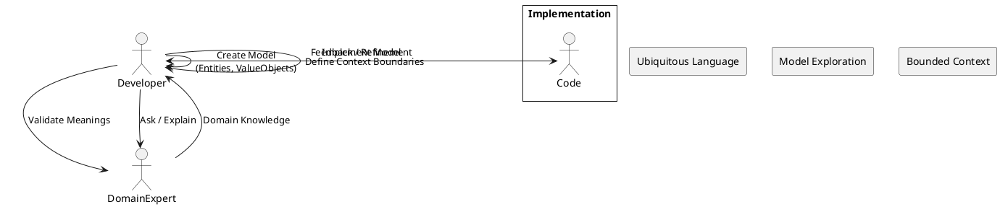

了解です！  
では **A（あなたがメッセージ欄に貼った長文）** を対象に、NotebookLM 用読書ノートに最適化して変換します。

このあと以下を出力します：

# 📘 出力内容

1. **要点を正確に抽出した「読書ノート」**（NotebookLMにそのまま食わせられる形式）
    
2. **重要概念の図解（PlantUML）**
    
3. **キーワードの辞書**
    
4. **議論を深めるための質問集（NotebookLMが喜ぶ形式）**
    

---

# 📘 NotebookLM 用：DDD 読書ノート（Deep Dive Version）

## 🎯 この章のテーマ

**「DDDはパターン集ではなく、現実世界の本質をモデル化する思考法である」  
そしてその思考がコードにどうつながるか。**

---

# 1. DDD の哲学：技術ではなく "思考法"

## ■ 軽量DDDの落とし穴（手軽さの罠）

- DDD を「パターン集」として理解すると失敗する。  
    → 値オブジェクト / リポジトリ / アグリゲートを覚えると、それを使った気になってしまう。
    
- 問題：**パターンを使うこと自体が目的化する**（最悪の状態）
    
- DDD の目的は
    
    - コードを綺麗にすることではなく
        
    - **ビジネスの本質を正しく表現すること**
        

📌 **パターンは目的ではない。"考える余白" を作る道具である。**

---

# 2. ドメイン理解の核心：ドメインエキスパートとのモデリング

## ■ 誤解はシステム崩壊の種

- 資料の例：  
    「友人と旅行の約束 → 当日ヘリで迎えに来た」  
    → 会話が成立しているようで、実はズレている。
    
- 現実ではもっと怖い：
    
    - 「新規保存」 vs 「登録」
        
    - 「引き当て」 vs 「予約」  
        → 一語の誤解が **数千万円の損害** につながる。
        

---

# 3. 双方向のモデリング：開発者も教える側になる

## ■ ドメインエキスパートは「技術が何を可能にするか」を知らない

→ 一方通行だと誤解が蓄積する。

## ★ 正しい姿は「相互教育」である

- ドメインエキスパート：ビジネスの知識を提供
    
- 開発者：技術的に可能な選択肢を提示  
    → その対話を通じて **本物のドメインモデル** が生まれる。
    

---

# 4. ユビキタス言語：翻訳コストをゼロにする

## ■ アップデート vs チェンジ

- `updateName()` は技術的
    
- `changeName()` はドメインの言葉
    

### 📌 翻訳コスト＝認知的負担

- コードを読むたびに「アップデートは変更のことだな」と変換する必要がある。
    
- この "翻訳の負債" が積もると、思考が鈍る。
    

---

# 5. 境界づけられたコンテキスト（Bounded Context）

### ■ 1つの巨大な「ユーザー」を作るのは最悪

- 認証ユーザー：パスワード情報
    
- SNSユーザー：サークル所属情報
    
- 物流ユーザー：配送先情報
    

→ これを1つにまとめると**地獄のオブジェクトが誕生する**

### ■ BC は「国境」

- 国境が変われば言語が変わる
    
- BC が変わればモデルと用語が変わる
    

---

# 6. コンテキストマップ：複数のBCの関係性を記述する地図

- どのBCが主導するか?（Partnership / Conformist / Anti-corruption layer）
    
- 翻訳役が必要か?（ACL）
    
- BC間の責任とデータの流れを明確化する。
    

📌 **DDD が巨大システムを破綻させない理由は、この「国同士の外交」にある。**

---

# 7. DDD はボトムアップ：完成形から始めてはいけない

- 完璧なモデルは最初から作れるはずがない。
    
- モデルは「対話→改善→対話→改善」のループで磨かれる。
    

📌 **DDD は“最初に正しい設計”を作る技術ではなく  
“間違っても修正し続けられる設計”を作る技術である。**

---

# 📊 PlantUML 図解（NotebookLM用）

## ■ ドメイン理解 → モデル化 → 実装 の流れ

---

# 🔑 重要用語辞書

|用語|意味|
|---|---|
|軽量DDD|パターンだけ取り入れ、ドメイン理解が欠けた状態|
|ユビキタス言語|プロジェクト内で全員が使う共通の厳密な言語|
|モデリング|ビジネスの本質をコードで表現する行為|
|BC（Bounded Context）|モデルが有効に機能する領域。国境線|
|コンテキストマップ|BC間の関係性を示す図|
|ドメインエキスパート|ビジネスの実践者。発注者とは限らない|

---

# 💬 NotebookLMに渡すための「思考を深める質問集」

- あなたのプロジェクトで「翻訳コスト」が発生している例は？
    
- 既存システムの中で「境界線を引き直した方がよい」部分は？
    
- ドメインエキスパートと行っている会話は「一方向的」になっていないか？
    
- あなたのチームでユビキタス言語を育てるために必要な習慣は？
    
- BC を分割するとき、あなたは何を基準に境界を引くべきか？
    

---

# 🚀 次にやりますか？

以下も作れます：

- NotebookLM向け **「カード形式」学習ノート**
    
- この内容の **音声台本（朗読調に最適化）**
    
- あなたのプロジェクトに合わせた **「自分用DDDガイド」**
    
- Obsidian対応の **分割ノート**（1ファイル1コンセプト）
    

必要なら「次へ」と言ってください。